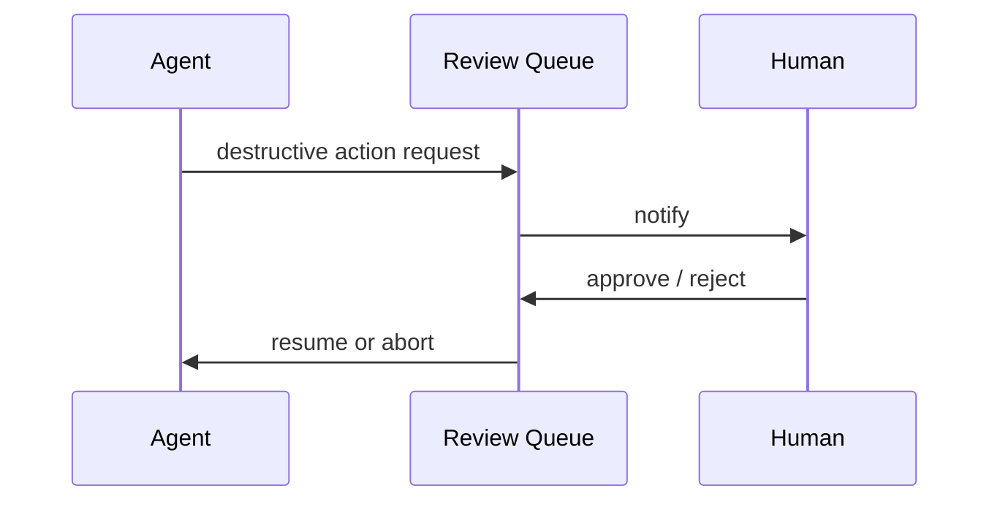

# Human-in-the-Loop for Agents

## Overview

Section **12**.

## Patterns

| Pattern | When |
|---------|------|
| **Pre-approval** | Before send email, payment, deploy |
| **Post-review** | Sample outputs for QA |
| **Escalation** | Low confidence or policy edge |
| **Correction** | Human edits agent plan |
| **Kill switch** | Immediate abort |

## Safe Execution

- Classify tools: read / write / destructive
- Auto-approve reads; queue writes
- Timeout approvals → fail closed

## Navigation

- [Agent Security](agent-security.md)

---

## Changelog

| Version | Date | Changes |
|---------|------|---------|
| 1.0 | 2026-07-13 | Initial publication |
