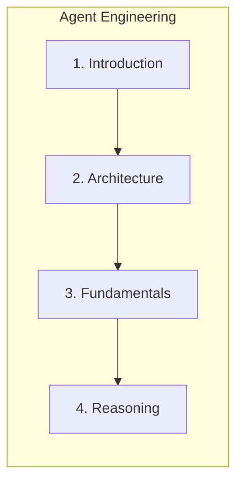
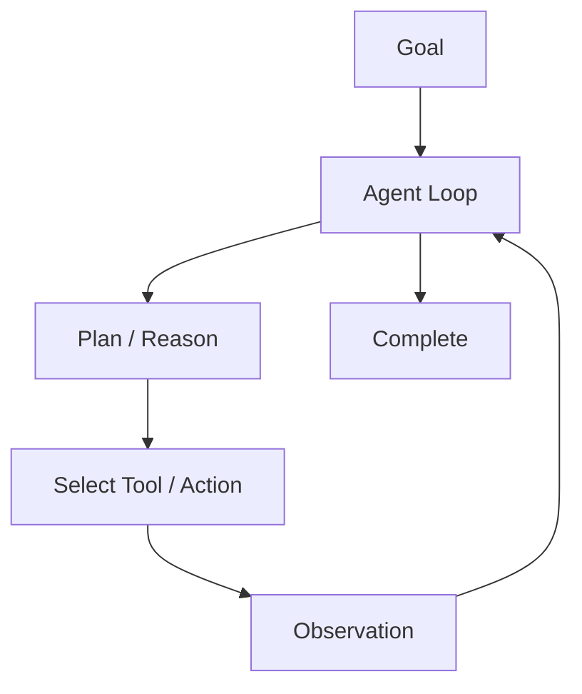
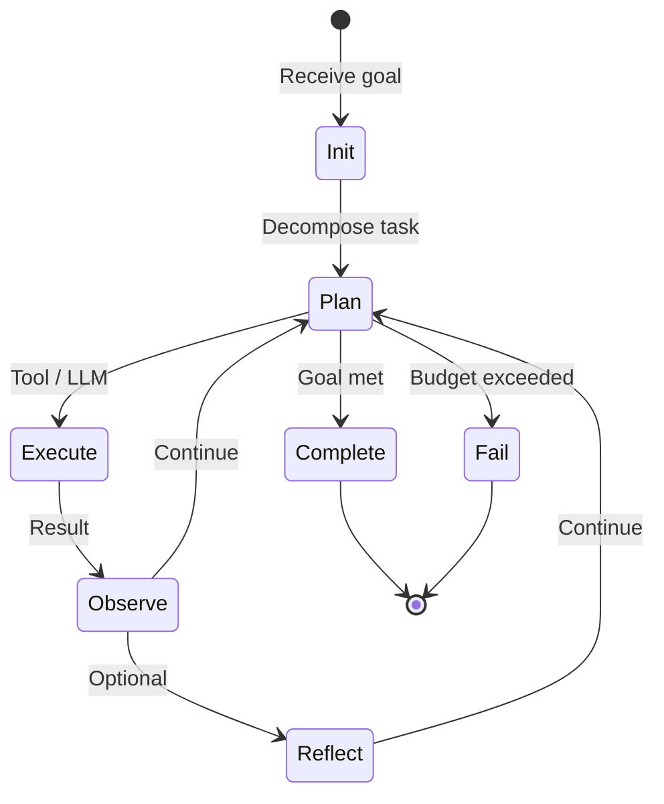

# Introduction to Agent Engineering

> Agent engineering is the discipline of designing autonomous, reliable, observable systems that perceive goals, plan, act through tools, learn from observations, and complete tasks in production environments.

## Table of Contents

- [Overview](#overview)
- [What Is an AI Agent?](#what-is-an-ai-agent)
- [Why Agents Exist](#why-agents-exist)
- [Agent vs Workflow](#agent-vs-workflow)
- [Agent vs Chatbot](#agent-vs-chatbot)
- [Agent vs RAG](#agent-vs-rag)
- [Agent vs Automation](#agent-vs-automation)
- [Characteristics of Autonomous Systems](#characteristics-of-autonomous-systems)
- [Modern Agent Ecosystem](#modern-agent-ecosystem)
- [Agent Lifecycle](#agent-lifecycle)
- [Agent Maturity Levels](#agent-maturity-levels)
- [Engineering Motivation](#engineering-motivation)
- [Production Considerations](#production-considerations)
- [Security Considerations](#security-considerations)
- [Best Practices](#best-practices)
- [Anti-Patterns](#anti-patterns)
- [Python Examples](#python-examples)
- [Interview Preparation](#interview-preparation)
- [Navigation](#navigation)

---

## Overview

An **AI agent** is not an LLM with tools bolted on. It is a **software system** with goals, state, memory, planning, tool execution, observation handling, and termination conditions — orchestrated around one or more language models for reasoning.

Section **1**.



> **Prerequisites:** [RAG](../rag/README.md) · [Context Engineering](../context-engineering/README.md) · [Prompt Engineering](../prompt-engineering/README.md) · [LLM Engineering](../llm-engineering/README.md)

---

## What Is an AI Agent?

| Term | Definition |
|------|------------|
| **Agent** | System that pursues goals through perceive → decide → act loops |
| **Autonomy** | Chooses next actions without fixed script for every step |
| **Tool** | External capability (API, DB, shell) invoked by the agent |
| **Observation** | Result of an action fed back into reasoning |
| **Termination** | Explicit condition when the agent stops |



---

## Why Agents Exist

| Limitation | Agent response |
|------------|----------------|
| Single-shot LLM can't multi-step | Iterative loop |
| Static RAG can't choose when to search | Dynamic tool selection |
| Workflows brittle to variation | Adaptive replanning |
| Humans bottleneck on ops tasks | Supervised automation |

Agents excel at **open-ended tasks** with tool access: coding, research, support resolution, data ops.

---

## Agent vs Workflow

| Dimension | Workflow | Agent |
|-----------|----------|-------|
| Control flow | Predetermined DAG | Dynamic decisions |
| Predictability | High | Lower |
| Flexibility | Low | High |
| Testing | Unit test steps | Eval + traces |
| Best for | Stable pipelines | Variable tasks |

**Production:** Use workflows for ETL; agents for user-facing autonomy with guardrails.

---

## Agent vs Chatbot

Chatbots **respond**. Agents **accomplish tasks** — may use many turns, tools, and background steps without user micromanagement.

---

## Agent vs RAG

RAG **retrieves knowledge**. Agents **orchestrate** — RAG is often one tool among many (search, code exec, tickets, email).

---

## Agent vs Automation

Traditional automation: fixed rules. Agents: LLM-mediated decisions with tool APIs — higher capability, higher risk without supervision.

---

## Characteristics of Autonomous Systems

1. **Goal-directed** — explicit success criteria
2. **Reactive** — incorporate observations
3. **Proactive** — take initiative within bounds
4. **Bounded** — max steps, budgets, permissions
5. **Observable** — traces for every decision

---

## Modern Agent Ecosystem

| Layer | Examples |
|-------|----------|
| Models | GPT-4o, Claude, Gemini |
| Frameworks | LangGraph, CrewAI, AutoGen, PydanticAI |
| Protocols | MCP, A2A (future phases) |
| Tools | APIs, RAG, browsers, IDEs |
| Ops | LangSmith, OpenTelemetry, custom traces |

---

## Agent Lifecycle



---

## Agent Maturity Levels

| Level | Description | Example |
|-------|-------------|---------|
| L0 | Single-shot prompt | Q&A |
| L1 | Tool loop (ReAct) | Support triage |
| L2 | Planning + memory | Coding assistant |
| L3 | Multi-agent + HITL | Enterprise ops |
| L4 | Long-running autonomous | Research platforms |

---

## Engineering Motivation

Ship agents like microservices: **SLOs, idempotency, permissions, evals, incident runbooks** — not demo notebooks.

---

## Production Considerations

- Max iterations and cost caps
- Checkpointing for long tasks
- Human approval for destructive tools

---

## Security Considerations

- Tool sandboxing and allowlists
- Prompt/tool injection defenses

See [Agent Security](agent-security.md).

---

## Best Practices

1. Start single-agent ReAct before multi-agent
2. Define termination and budgets explicitly
3. Log every tool call with correlation ID

---

## Anti-Patterns

| Anti-Pattern | Risk |
|--------------|------|
| Unbounded agent loop | Cost, infinite run |
| Agent for fixed ETL | Use workflow |
| No HITL on write tools | Data loss |

---

## Python Examples

```python
from dataclasses import dataclass
from typing import Callable, Any


@dataclass
class AgentConfig:
    max_steps: int = 20
    max_cost_usd: float = 1.0


class MinimalAgent:
    def __init__(self, llm, tools: dict[str, Callable], config: AgentConfig):
        self.llm = llm
        self.tools = tools
        self.config = config

    async def run(self, goal: str) -> Any:
        context = {"goal": goal, "steps": []}
        for _ in range(self.config.max_steps):
            action = await self.llm.decide(context, self.tools.keys())
            if action.type == "finish":
                return action.result
            obs = await self.tools[action.tool](**action.args)
            context["steps"].append({"action": action, "observation": obs})
        raise TimeoutError("max_steps exceeded")
```

---

## Interview Preparation

**Q: When use an agent vs a workflow?**

> Workflow when steps are fixed and testable. Agent when task path varies and requires tool selection and replanning — with strict budgets.

**Q: How is an agent different from RAG?**

> RAG is a retrieval pattern. An agent is a control system that may call RAG, APIs, code, and humans to achieve a goal.

---

## Navigation

### Prerequisites

- [RAG](../rag/README.md) · [Context Engineering](../context-engineering/README.md)

### Next

- [Agent Architecture](agent-architecture.md)

### Unlocks

- [MCP](../mcp/README.md) · [Multi-Agent Systems](../multi-agent-systems/README.md)

---

## Changelog

| Version | Date | Changes |
|---------|------|---------|
| 1.0 | 2026-07-13 | Initial publication |
