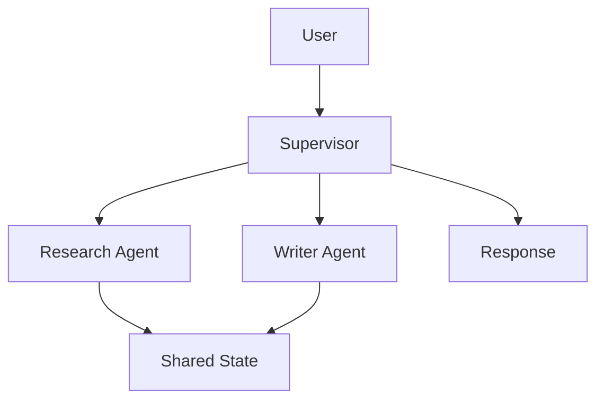

# Multi-Agent Systems

## Overview

Section **11** of Phase 8.

| Architecture | Pattern | Strengths | Weaknesses | Scale |
|--------------|---------|-----------|------------|-------|
| **Supervisor** | Lead delegates to workers | Control, clarity | Supervisor bottleneck | Medium |
| **Swarm** | Peers collaborate | Parallelism | Coordination overhead | High |
| **Debate** | Adversarial roles | Quality | Cost, latency | Low |
| **Critic** | Generator + reviewer | Safer outputs | Extra round | Medium |
| **Planner-Executor** | Plan then specialized workers | Separation | Handoff errors | Medium |
| **Router** | Intent → specialist agent | Efficiency | Router errors | High |
| **Manager** | Hierarchy of supervisors | Enterprise org fit | Complexity | High |
| **Blackboard** | Shared memory board | Loose coupling | Race conditions | Medium |
| **Marketplace** | Agents bid for tasks | Resource allocation | Complex | Research |

## Supervisor Workflow

## Production Use Cases

- **Supervisor:** Customer ops with specialized tools
- **Debate:** Legal risk review (with HITL)
- **Router:** Multi-intent enterprise assistant

## Navigation

- [Agent Communication](agent-communication.md) · [Human-in-the-Loop](human-in-the-loop.md)

---

## Changelog

| Version | Date | Changes |
|---------|------|---------|
| 1.0 | 2026-07-13 | Phase 8 Section 11 |
