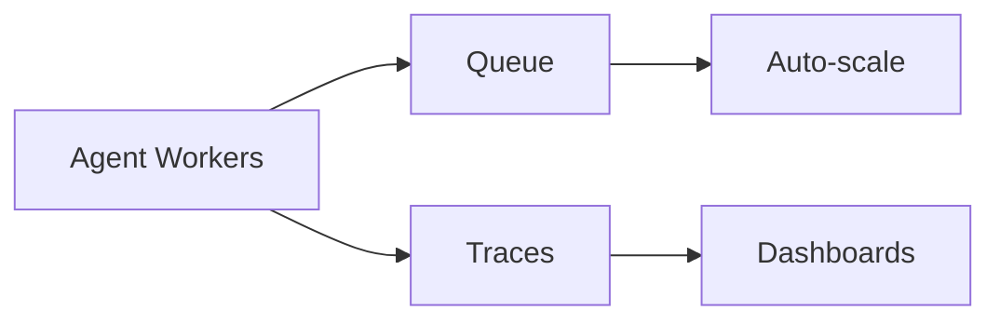

# Production Agent Engineering

## Overview

Section **17** of Phase 8.

## Operations Checklist

| Area | Practice |
|------|----------|
| **Observability** | Span per step; log tool I/O redacted |
| **Tracing** | OpenTelemetry / LangSmith |
| **Cost** | Per-run budget; model routing |
| **Rate limits** | Per user/tenant |
| **Retries** | Exponential backoff; idempotent tools |
| **Checkpointing** | Resume long runs |
| **Queues** | Celery/SQS for async agents |
| **Multi-tenant** | Isolated state + tool credentials |

## Reliability SLOs

- p95 latency per task type
- Success rate ≥ target (e.g. 95%)
- Max cost per run enforced

## Navigation

- [Agent Security](agent-security.md)

---

## Changelog

| Version | Date | Changes |
|---------|------|---------|
| 1.0 | 2026-07-13 | Phase 8 Section 17 |
