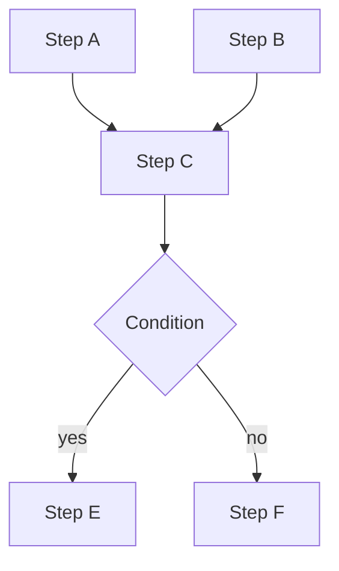

# Task Graphs for Agents

## Overview

Section **9**.

## Concepts

| Concept | Description |
|---------|-------------|
| **DAG** | Directed acyclic graph of tasks |
| **Dependency** | B waits for A |
| **Parallel** | A and B concurrent |
| **Conditional** | Branch on observation |
| **Loop** | Repeat until condition (max iterations) |

## Scheduling

Topological sort → execute ready nodes in parallel pools. LangGraph models this as graph nodes/edges.

## Production

- Max parallelism limits
- Per-node timeouts
- Deadlock detection on cyclic graphs (forbid cycles in DAG mode)

## Navigation

- [Event-Driven Agents](event-driven-agents.md)

---

## Changelog

| Version | Date | Changes |
|---------|------|---------|
| 1.0 | 2026-07-13 | Initial publication |
