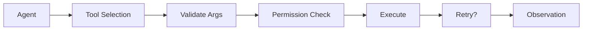

# Tool Use for AI Agents

## Overview

Section **7** of Phase 8 — one of the largest agent topics.



## Tool Registry

```python
@dataclass
class ToolSpec:
    name: str
    description: str
    parameters: dict  # JSON Schema
    permissions: list[str]
    timeout_s: float = 30.0
    idempotent: bool = False
```

## Execution Concerns

| Concern | Pattern |
|---------|---------|
| **Validation** | Pydantic / JSON Schema before call |
| **Permissions** | RBAC per tool + tenant |
| **Failures** | Classify retryable vs fatal |
| **Parallel** | `asyncio.gather` for independent tools |
| **Chaining** | Output of tool A → input of tool B in plan |
| **Dynamic tools** | MCP discovery at runtime |

## Anti-Patterns

- Exposing shell without sandbox
- Unbounded retry on non-idempotent tools
- Tools that return unbounded text (context explosion)

## Framework Execution

LangGraph: tool nodes. OpenAI Agents SDK: `function_tool`. PydanticAI: typed tool functions.

## Navigation

- [Agent Security](agent-security.md) · [LLM Tool Calling](../llm-engineering/llm-tool-calling.md)

---

## Changelog

| Version | Date | Changes |
|---------|------|---------|
| 1.0 | 2026-07-13 | Phase 8 Section 7 |
