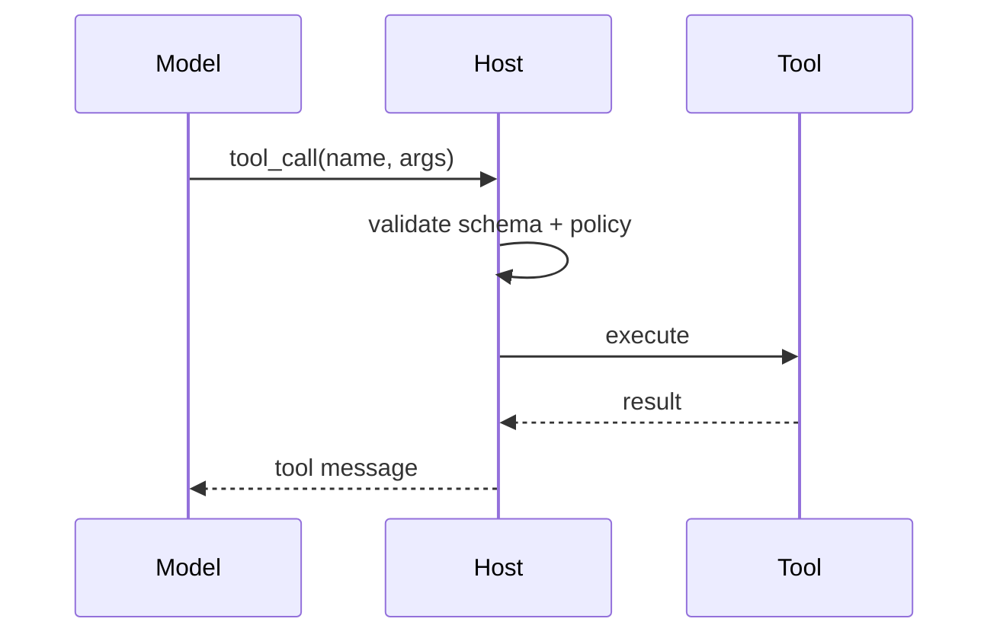

# Tool Use

> Tools are how agents affect the world. Treat every tool call as an **untrusted program invocation** gated by schema validation and policy.

## Definition

A **tool** is a typed function the model may call: name, description, JSON schema for arguments, and a host-side implementation that returns an observation string/object.

## Lifecycle



## Schema-first design

```python
TOOL = {
    "name": "create_ticket",
    "description": "Create a support ticket",
    "parameters": {
        "type": "object",
        "properties": {
            "title": {"type": "string", "maxLength": 120},
            "priority": {"enum": ["low", "med", "high"]},
        },
        "required": ["title"],
        "additionalProperties": False,
    },
}
```

Reject unknown fields. Coerce types in the host, not in the prompt.

## Safety tiers

| Tier | Examples | Gate |
|------|----------|------|
| Read | search, get_order | AuthZ filters |
| Write | create_ticket | Idempotency keys |
| Dangerous | refund, delete, shell | Human approval |

## Common mistakes

- Passing free-form SQL/shell from the model.
- No timeout → hung agents.
- Giant tool catalogs → wrong selections.
- Returning huge blobs into context without summarization.

## Production

Log tool name, latency, success, and redacted args. Rate-limit per tenant. Prefer MCP or internal gateways for shared tools.

## Interview

**Q: How do you stop prompt injection from calling `delete_user`?** Defense in depth: do not expose the tool; require step-up auth; validate args; separate system policy from retrieved text.


## Observation hygiene

- Return concise structured JSON when possible
- Truncate large payloads with pointers to artifacts
- Include error codes the model can recover from

## Testing tools

```python
def test_create_ticket_schema():
    args = {"title": "Billing"}
    assert validate(TOOL, args) is True
```

Unit-test validators without an LLM. Integration-test with recorded fixtures.

## MCP

Shared enterprise tools often live behind [MCP](../../mcp/README.md) servers — same schema/validation rules apply.

## Navigation

- [HITL](02-human-in-the-loop.md) · [Architecture](../foundations/03-agent-architecture.md)
- [Section hub](README.md) · [Agents hub](../README.md)
