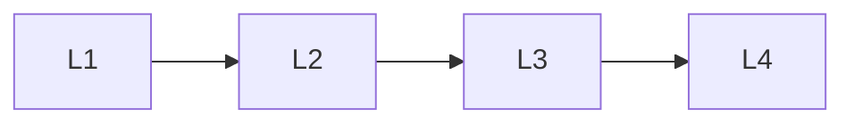

# Tools & Action

> Section of the **ai-agents** handbook.

## Lessons

| # | Lesson |
|---|--------|
| 1 | [Tool Use](01-tool-use.md) |
| 2 | [Human In The Loop](02-human-in-the-loop.md) |
| 3 | [Event Driven Agents](03-event-driven-agents.md) |
| 4 | [Agent Communication](04-agent-communication.md) |

**Topic hub:** [../README.md](../README.md)
