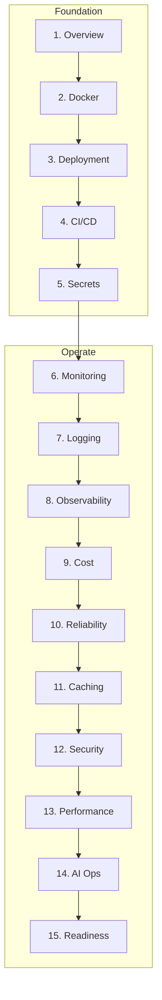

# Production AI & AI Platform Engineering

> Deploy, operate, monitor, secure, and scale AI applications — AI platform engineering, not generic DevOps.
> **Prerequisites:** [System Design](../ai-system-design/README.md) · [Evaluation](../ai-evaluation/README.md)

---

## Module Overview

---

## Documents (15 Sections)

| # | Topic | Document |
|---|-------|----------|
| 1 | Overview | [production-ai-overview.md](production-ai-overview.md) |
| 2 | Docker | [docker-for-ai.md](docker-for-ai.md) |
| 3 | Deployment | [ai-deployment-strategies.md](ai-deployment-strategies.md) |
| 4 | CI/CD | [cicd-for-ai.md](cicd-for-ai.md) |
| 5 | Secrets | [secrets-management-for-ai.md](secrets-management-for-ai.md) |
| 6 | Monitoring | [monitoring-ai-systems.md](monitoring-ai-systems.md) |
| 7 | Logging | [logging-for-ai.md](logging-for-ai.md) |
| 8 | Observability | [observability-for-ai.md](observability-for-ai.md) |
| 9 | Cost Tracking | [cost-tracking-production.md](cost-tracking-production.md) |
| 10 | Reliability | [reliability-for-ai.md](reliability-for-ai.md) |
| 11 | Caching | [caching-for-ai.md](caching-for-ai.md) |
| 12 | Security | [security-production-ai.md](security-production-ai.md) |
| 13 | Performance | [performance-optimization-production.md](performance-optimization-production.md) |
| 14 | AI Operations | [ai-operations.md](ai-operations.md) |
| 15 | Readiness | [production-readiness-checklist.md](production-readiness-checklist.md) |

**Comparisons:** [production-ai-comparison-guides.md](production-ai-comparison-guides.md)

---

## Code Examples

[`examples/production-ai/`](../../examples/production-ai/) — Docker, CI, OpenTelemetry, health, logging, cache, retry, rate limit, cost

---

## Cheat Sheets

- [Production Deployment](../../cheat-sheets/production-deployment-cheat-sheet.md)
- [Docker Commands](../../cheat-sheets/docker-ai-cheat-sheet.md)
- [CI/CD Workflow](../../cheat-sheets/cicd-ai-workflow-cheat-sheet.md)
- [Monitoring](../../cheat-sheets/monitoring-ai-checklist.md)
- [Observability](../../cheat-sheets/observability-ai-checklist.md)
- [Reliability](../../cheat-sheets/reliability-ai-checklist.md)
- [Incident Response](../../cheat-sheets/incident-response-ai-checklist.md)
- [Production Readiness](../../cheat-sheets/production-readiness-checklist.md)

---

## Related Domains

- [Docker](../docker/README.md) · [CI/CD](../cicd/README.md) · [Observability](../observability/README.md)

---

## See Also

- [AI System Design](../ai-system-design/README.md)
