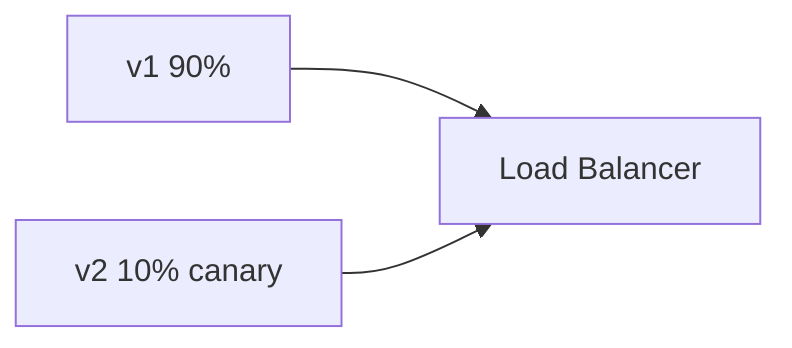

# AI Deployment Strategies

## Overview

Section **3**.

## Strategies

| Strategy | Risk | Use |
|----------|------|-----|
| **Rolling** | Medium | Default K8s |
| **Blue/Green** | Low | Instant switchback |
| **Canary** | Lowest | AI prompt/model changes |

## AI-Specific Concerns

- Run eval on canary before ramp
- Compare latency/cost metrics v1 vs v2
- Feature flag prompt template

## Environments

| Env | Purpose |
|-----|---------|
| Local | Docker Compose |
| Staging | Prod-like + synthetic traffic |
| Prod | Real users |

## Navigation

- [CI/CD for AI](cicd-for-ai.md)

---

## Changelog

| Version | Date | Changes |
|---------|------|---------|
| 1.0 | 2026-07-13 | Initial publication |
