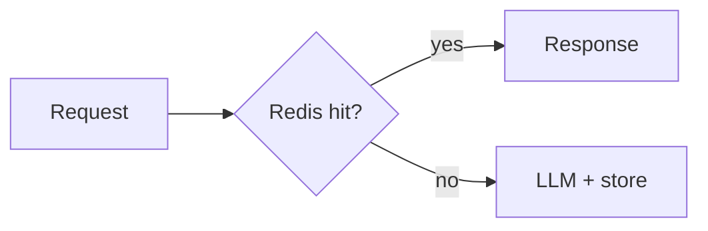

# Caching for AI Applications

## Overview

Section **11** of Phase 12.

## Cache Types

| Cache | Key | TTL |
|-------|-----|-----|
| **Prompt prefix** | Provider-managed | Session |
| **Embedding** | hash(text) | Days |
| **Retrieval** | hash(query+index_ver) | Minutes |
| **Full response** | hash(query+prompt_ver) | Short |
| **Session context** | session_id | Hours |

## Invalidation

Bump `prompt_version` or `index_version` in cache key.

## Navigation

- [Security](security-production-ai.md)

---

## Changelog

| Version | Date | Changes |
|---------|------|---------|
| 1.0 | 2026-07-13 | Phase 12 Section 11 |
