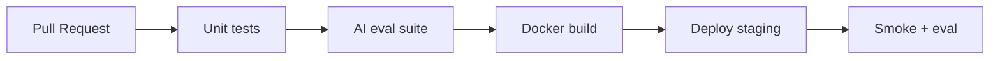

# CI/CD for AI Applications

## Overview

Section **4**.

## Pipeline Stages

1. **Lint + unit tests**
2. **AI regression eval** — golden set; fail if metrics drop
3. **Build & push image**
4. **Deploy staging**
5. **Integration eval**
6. **Manual/auto promote prod**

## GitHub Actions Pattern

See [`.github-workflows-ci.yml`](../../examples/production-ai/.github-workflows-ci.yml) example.

## Rollback

- Keep previous image tag
- Revert prompt flag instantly
- Re-run eval on rollback build

## Navigation

- [Secrets Management](secrets-management-for-ai.md)

---

## Changelog

| Version | Date | Changes |
|---------|------|---------|
| 1.0 | 2026-07-13 | Initial publication |
