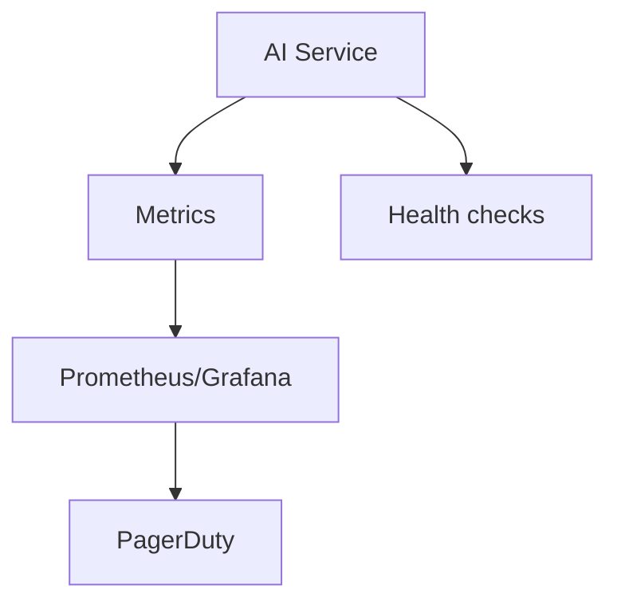

# Monitoring AI Systems

## Overview

Section **6**.

## Key Metrics

| Category | Examples |
|----------|----------|
| **Quality** | Faithfulness score, error rate |
| **Latency** | p95 E2E, TTFT |
| **Cost** | $/hour, tokens/min |
| **Reliability** | 5xx rate, timeout rate |

## Health Checks

- `/health` — process up
- `/ready` — DB, Redis, model API reachable

## SLO Example

99.5% requests < 5s over 30 days; error budget → freeze features.

## Navigation

- [Logging](logging-for-ai.md)

---

## Changelog

| Version | Date | Changes |
|---------|------|---------|
| 1.0 | 2026-07-13 | Initial publication |
