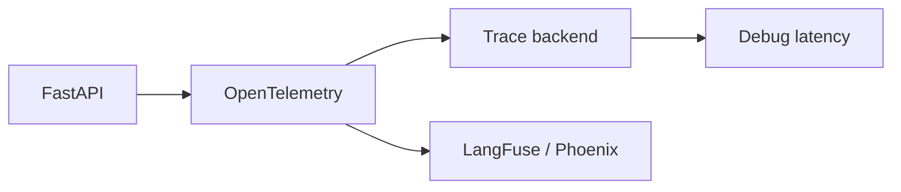

# Observability for AI

## Overview

Section **8** of Phase 12.



## Stack Comparison

| Tool | Strength |
|------|----------|
| **OpenTelemetry** | Standard traces/metrics |
| **LangFuse** | LLM-native; prompts, costs |
| **Phoenix** | RAG debugging, embeddings |

## What to Trace

- Prompt template version + token count
- Retrieval: query, chunks, scores
- LLM: model, latency, finish reason
- Agent: each tool span
- Workflow: DAG node timings

## Python (OpenTelemetry)

```python
from opentelemetry import trace
tracer = trace.get_tracer("ai-service")

async def call_llm(prompt: str) -> str:
    with tracer.start_as_current_span("llm.completion") as span:
        span.set_attribute("prompt.tokens", len(prompt.split()))
        return await llm_api(prompt)
```

## Navigation

- [Cost Tracking](cost-tracking-production.md)

---

## Changelog

| Version | Date | Changes |
|---------|------|---------|
| 1.0 | 2026-07-13 | Phase 12 Section 8 |
