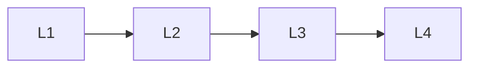

# Observability

> Section of the **ai-deployment** handbook.

## Lessons

| # | Lesson |
|---|--------|
| 1 | [Monitoring Ai Systems](01-monitoring-ai-systems.md) |
| 2 | [Logging For Ai](02-logging-for-ai.md) |
| 3 | [Observability For Ai](03-observability-for-ai.md) |
| 4 | [Cost Tracking Production](04-cost-tracking-production.md) |

**Topic hub:** [../README.md](../README.md)
