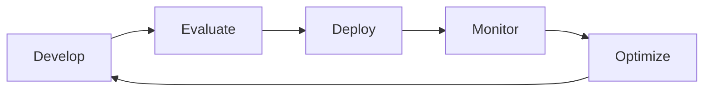
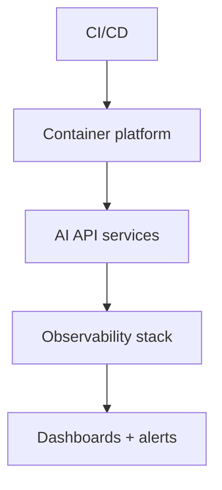

# Production AI Overview

## Overview

Section **1** of Phase 12 — **AI Platform Engineering**, not generic DevOps.

## AI Production Lifecycle

1. Build feature + eval cases
2. CI: tests + regression eval
3. Deploy canary → ramp
4. Monitor quality, latency, cost
5. Incident response + postmortem
6. Feed failures into golden set

## Platform Architecture

## Reliability Principles

- Timeouts on every LLM/tool call
- Idempotent workers
- Feature flags for model/prompt

## Deployment Strategies

Blue/green, canary, rolling — see [Deployment](ai-deployment-strategies.md).

## Navigation

- [Docker for AI](docker-for-ai.md)

---

## Changelog

| Version | Date | Changes |
|---------|------|---------|
| 1.0 | 2026-07-13 | Phase 12 Section 1 |
