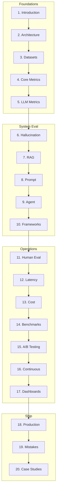

# AI Evaluation & LLMOps Evaluation

> Definitive engineering reference for measuring, validating, monitoring, and continuously improving production AI systems.
> **Prerequisites:** [MCP](../mcp/README.md) · [Agents](../ai-agents/README.md) · [RAG](../rag/README.md)

---

## Module Overview

AI evaluation is a complete engineering discipline — not simply model accuracy.

**Unlocks:** Production AI · Observability · Continuous improvement · Governance

---

## Documents (20 Sections)

| # | Topic | Document |
|---|-------|----------|
| 1 | Introduction | [introduction-to-ai-evaluation.md](introduction-to-ai-evaluation.md) |
| 2 | Architecture | [evaluation-architecture.md](evaluation-architecture.md) |
| 3 | Datasets | [evaluation-datasets.md](evaluation-datasets.md) |
| 4 | Core Metrics | [core-metrics.md](core-metrics.md) |
| 5 | LLM Metrics | [llm-evaluation-metrics.md](llm-evaluation-metrics.md) |
| 6 | Hallucination | [hallucination-detection.md](hallucination-detection.md) |
| 7 | RAG Evaluation | [rag-evaluation.md](rag-evaluation.md) |
| 8 | Prompt Evaluation | [prompt-evaluation.md](prompt-evaluation.md) |
| 9 | Agent Evaluation | [agent-evaluation.md](agent-evaluation.md) |
| 10 | Frameworks | [evaluation-frameworks.md](evaluation-frameworks.md) |
| 11 | Human Evaluation | [human-evaluation.md](human-evaluation.md) |
| 12 | Latency | [latency-evaluation.md](latency-evaluation.md) |
| 13 | Cost | [cost-evaluation.md](cost-evaluation.md) |
| 14 | Benchmarking | [benchmarking.md](benchmarking.md) |
| 15 | A/B Testing | [ab-testing.md](ab-testing.md) |
| 16 | Continuous Eval | [continuous-evaluation.md](continuous-evaluation.md) |
| 17 | Dashboards | [evaluation-dashboards.md](evaluation-dashboards.md) |
| 18 | Production | [production-evaluation.md](production-evaluation.md) |
| 19 | Mistakes | [evaluation-mistakes.md](evaluation-mistakes.md) |
| 20 | Case Studies | [evaluation-case-studies.md](evaluation-case-studies.md) |

**Comparisons:** [ai-evaluation-comparison-guides.md](ai-evaluation-comparison-guides.md)

### Framework Guides (Section 10)

[RAGAS](frameworks/ragas.md) · [DeepEval](frameworks/deepeval.md) · [LangSmith](frameworks/langsmith.md) · [Phoenix](frameworks/phoenix.md) · [OpenAI Evals](frameworks/openai-evals.md)

---

## Code Examples

[`examples/ai-evaluation/`](../../examples/ai-evaluation/) — RAGAS-style, DeepEval, RAG, agent, latency, cost, A/B, regression

---

## Cheat Sheets

- [Evaluation Workflow](../../cheat-sheets/evaluation-workflow-cheat-sheet.md)
- [Metric Selection](../../cheat-sheets/metric-selection-cheat-sheet.md)
- [RAG Evaluation](../../cheat-sheets/rag-evaluation-checklist.md)
- [Prompt Evaluation](../../cheat-sheets/prompt-evaluation-checklist.md)
- [Agent Evaluation](../../cheat-sheets/agent-evaluation-checklist.md)
- [Latency](../../cheat-sheets/latency-evaluation-checklist.md)
- [Cost](../../cheat-sheets/cost-evaluation-checklist.md)
- [A/B Testing](../../cheat-sheets/ab-testing-checklist.md)
- [Production Readiness](../../cheat-sheets/production-evaluation-readiness-checklist.md)

---

## Learning Path

1. **Foundations** — Introduction, architecture, datasets, metrics (1–5)
2. **System evaluation** — Hallucination, RAG, prompt, agent, frameworks (6–10)
3. **Operations** — Human, latency, cost, benchmarks, A/B, continuous (11–16)
4. **Production** — Dashboards, scale, mistakes, case studies (17–20)

---

## Completion Checklist

- [ ] Define golden dataset for your product
- [ ] Run RAG or agent eval harness
- [ ] Add CI regression gate
- [ ] Track latency + cost with quality
- [ ] Set up dashboard or export metrics
- [ ] Document human review rubric

---

## See Also

- [RAG Evaluation](../rag/rag-evaluation.md)
- [Agent Evaluation](../ai-agents/agent-evaluation.md)
- [Prompt Evaluation](../prompt-engineering/prompt-evaluation.md)
