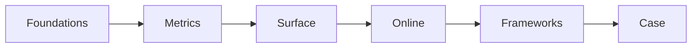

# LLM Evaluation

> Offline and online evaluation for prompts, RAG, agents, and production LLM systems.

**Prerequisites:** [Prompt Engineering](../prompt-engineering/README.md) · [RAG](../rag/README.md)  
**Unlocks:** [MLOps & LLMOps](../mlops-llmops/README.md) · [AI Agents](../ai-agents/README.md)

Thin lessons deepened 2026-08-12. Start with a section hub below (or expand the topic in the left sidebar).

---

## Sections

| # | Section | What you will learn | Hub |
|---|---------|---------------------|-----|
| 1 | **Foundations** | Intro, architecture, datasets | [foundations/](foundations/README.md) |
| 2 | **Metrics** | Quality, judge, latency, cost | [metrics/](metrics/README.md) |
| 3 | **Surface Areas** | Prompt, RAG, agent, human | [surface-areas/](surface-areas/README.md) |
| 4 | **Online Systems** | A/B, continuous, dashboards | [online-systems/](online-systems/README.md) |
| 5 | **Frameworks** | RAGAS, DeepEval, LangSmith, … | [frameworks/](frameworks/README.md) |
| 6 | **Case Studies** | Mistakes and comparisons | [case-studies/](case-studies/README.md) |

```mermaid
flowchart LR
  S1[Foundations] --> S2[Metrics] --> S3[Surface] --> S4[Online] --> S5[Frameworks] --> S6[Case]
```

---

## Hierarchy

### Foundations

| # | Topic |
|---|-------|
| 1 | [Introduction To Ai Evaluation](foundations/01-introduction-to-ai-evaluation.md) |
| 2 | [Evaluation Architecture](foundations/02-evaluation-architecture.md) |
| 3 | [Evaluation Datasets](foundations/03-evaluation-datasets.md) |
| 4 | [Benchmarking](foundations/04-benchmarking.md) |

### Metrics

| # | Topic |
|---|-------|
| 1 | [Core Metrics](metrics/01-core-metrics.md) |
| 2 | [Llm Evaluation Metrics](metrics/02-llm-evaluation-metrics.md) |
| 3 | [Hallucination Detection](metrics/03-hallucination-detection.md) |
| 4 | [Latency Evaluation](metrics/04-latency-evaluation.md) |
| 5 | [Cost Evaluation](metrics/05-cost-evaluation.md) |

### Surface Areas

| # | Topic |
|---|-------|
| 1 | [Prompt Evaluation](surface-areas/01-prompt-evaluation.md) |
| 2 | [Rag Evaluation](surface-areas/02-rag-evaluation.md) |
| 3 | [Agent Evaluation](surface-areas/03-agent-evaluation.md) |
| 4 | [Human Evaluation](surface-areas/04-human-evaluation.md) |

### Online Systems

| # | Topic |
|---|-------|
| 1 | [Ab Testing](online-systems/01-ab-testing.md) |
| 2 | [Continuous Evaluation](online-systems/02-continuous-evaluation.md) |
| 3 | [Production Evaluation](online-systems/03-production-evaluation.md) |
| 4 | [Evaluation Dashboards](online-systems/04-evaluation-dashboards.md) |

### Frameworks

| # | Topic |
|---|-------|
| 1 | [Deepeval](frameworks/02-deepeval.md) |
| 2 | [Langsmith](frameworks/03-langsmith.md) |
| 3 | [Openai Evals](frameworks/04-openai-evals.md) |
| 4 | [Phoenix](frameworks/05-phoenix.md) |
| 5 | [Ragas](frameworks/06-ragas.md) |

### Case Studies

| # | Topic |
|---|-------|
| 1 | [Evaluation Case Studies](case-studies/01-evaluation-case-studies.md) |
| 2 | [Evaluation Mistakes](case-studies/02-evaluation-mistakes.md) |
| 3 | [Ai Evaluation Comparison Guides](case-studies/03-ai-evaluation-comparison-guides.md) |
| 4 | [Evaluation Frameworks](case-studies/04-evaluation-frameworks.md) |

---

## Definition

**LLM evaluation** measures quality, safety, latency, and cost so you can ship model and prompt changes with evidence.

---

## Related topics

- [Domains overview](../README.md)
- [Master Index](../../meta/indexes/MASTER-INDEX.md)

---

## Continue learning

Next: [AI Agents](../ai-agents/README.md)

