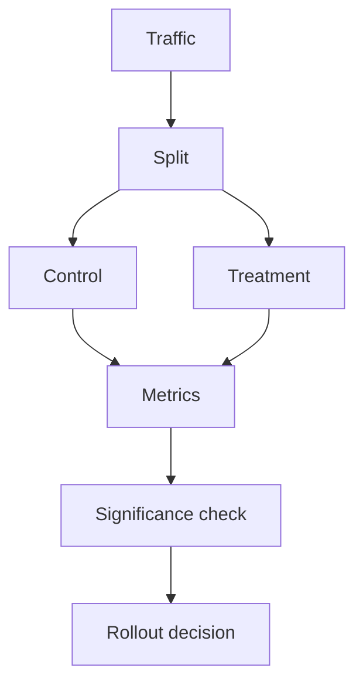

# A/B Testing for AI Systems

## Overview

Section **15**.



## Experiment Types

| Test | Control vs Treatment |
|------|---------------------|
| **Prompt** | Template v1 vs v2 |
| **Model** | GPT-4 vs Claude |
| **RAG** | Chunk size, reranker |
| **Agent** | Planner prompt, tools |

## Statistical Considerations (High Level)

- Define primary metric upfront
- Need sufficient sample size
- Watch for novelty effects
- Segment by user cohort

## Rollout Strategies

1. **Canary** — 1–5% traffic
2. **Ramp** — 25% → 50% → 100%
3. **Rollback** — instant revert on SLO breach

## Python Example

```python
import hashlib

def assign_variant(user_id: str, experiment: str) -> str:
    h = int(hashlib.md5(f"{experiment}:{user_id}".encode()).hexdigest(), 16)
    return "treatment" if h % 100 < 50 else "control"
```

## Anti-Patterns

- Peeking at results and stopping early
- Multiple uncontrolled changes at once

## Navigation

- [Continuous Evaluation](continuous-evaluation.md)

---

## Changelog

| Version | Date | Changes |
|---------|------|---------|
| 1.0 | 2026-07-13 | Initial publication |
