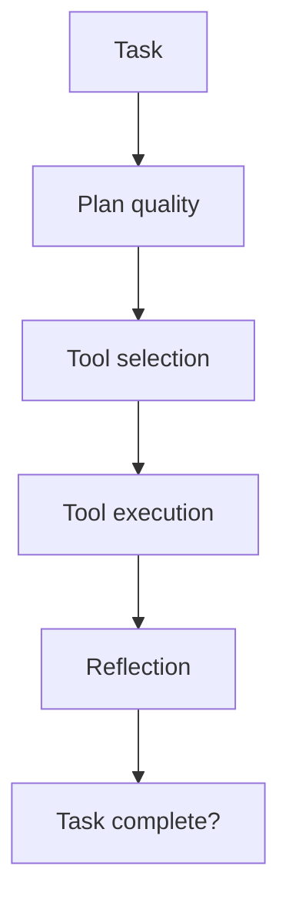

# Agent Evaluation

## Overview

Section **9** of Phase 10. Extends [Agent Evaluation (Phase 8)](../ai-agents/agent-evaluation.md) with production LLMOps metrics.



## Metrics

| Metric | How to measure |
|--------|----------------|
| **Task completion** | End state vs goal rubric |
| **Planning quality** | Human or judge on plan steps |
| **Tool selection** | Correct tool in trace |
| **Tool accuracy** | Args match schema + outcome |
| **Reflection quality** | Recovery after errors |
| **Recovery** | Success after failed tool call |
| **Multi-agent coordination** | Handoff success rate |
| **Memory quality** | Recall of prior context |
| **Workflow success** | Full pipeline pass |

## MCP / Tool Workflows

- Log every `tools/call` with latency and result
- Golden trajectories: expected tool sequence
- Compare actual vs expected graph

## Production Considerations

- Expensive — use tiered eval (smoke → full)
- Sandbox tools for safe replay

## Python Example

```python
def tool_selection_accuracy(trace: list[str], expected: list[str]) -> float:
    matches = sum(1 for a, b in zip(trace, expected) if a == b)
    return matches / max(len(expected), 1)
```

## Navigation

- [Evaluation Frameworks](evaluation-frameworks.md)

---

## Changelog

| Version | Date | Changes |
|---------|------|---------|
| 1.0 | 2026-07-13 | Phase 10 Section 9 |
