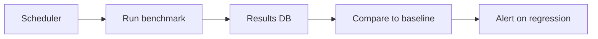

# AI Benchmarking

## Overview

Section **14**.

## Benchmark Types

| Type | Purpose |
|------|---------|
| **Public** | Model capability (MMLU, HumanEval) |
| **Internal** | Your product tasks |
| **Custom** | Domain-specific suites |
| **Regression** | Block deploy on drop |
| **Performance** | Latency/cost under load |

## Strengths and Limitations

| Strength | Limitation |
|----------|------------|
| Comparable across models | May not reflect your users |
| Good for model selection | Contamination / overfitting |
| Automated | Gaming via prompt tuning |

## Benchmark Automation

## Best Practices

- Internal benchmarks > public alone for ship decisions
- Version benchmark datasets
- Report slice metrics

## Navigation

- [A/B Testing](ab-testing.md)

---

## Changelog

| Version | Date | Changes |
|---------|------|---------|
| 1.0 | 2026-07-13 | Initial publication |
