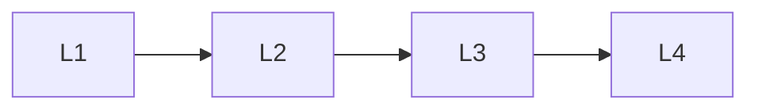

# Case Studies

> Section of the **ai-evaluation** handbook.

## Lessons

| # | Lesson |
|---|--------|
| 1 | [Evaluation Case Studies](01-evaluation-case-studies.md) |
| 2 | [Evaluation Mistakes](02-evaluation-mistakes.md) |
| 3 | [Ai Evaluation Comparison Guides](03-ai-evaluation-comparison-guides.md) |
| 4 | [Evaluation Frameworks](04-evaluation-frameworks.md) |

**Topic hub:** [../README.md](../README.md)
