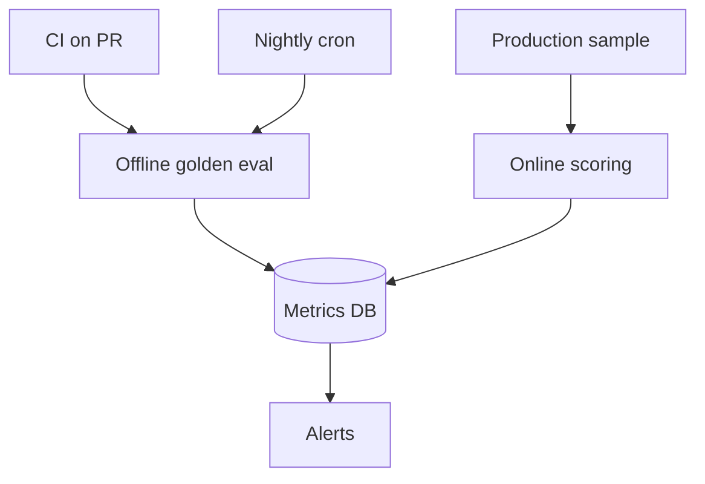

# Continuous Evaluation

## Overview

Section **16**.



## Components

| Component | Function |
|-----------|----------|
| **Scheduled eval** | Nightly full golden run |
| **Production monitoring** | Sample + score async |
| **Drift detection** | Input/output distribution shift |
| **Regression detection** | Metric vs baseline |
| **Automated alerts** | Pager on threshold |
| **CI/CD integration** | PR gate |

## Drift Types

- **Data drift** — new query topics
- **Model drift** — after model swap
- **Index drift** — stale corpus

## Best Practices

- Same harness offline and online where possible
- Alert on faithfulness + latency composite

## Python Example

```python
def regression_gate(current: float, baseline: float, tolerance: float = 0.05) -> bool:
    return current >= baseline - tolerance
```

## Navigation

- [Evaluation Dashboards](evaluation-dashboards.md)

---

## Changelog

| Version | Date | Changes |
|---------|------|---------|
| 1.0 | 2026-07-13 | Initial publication |
