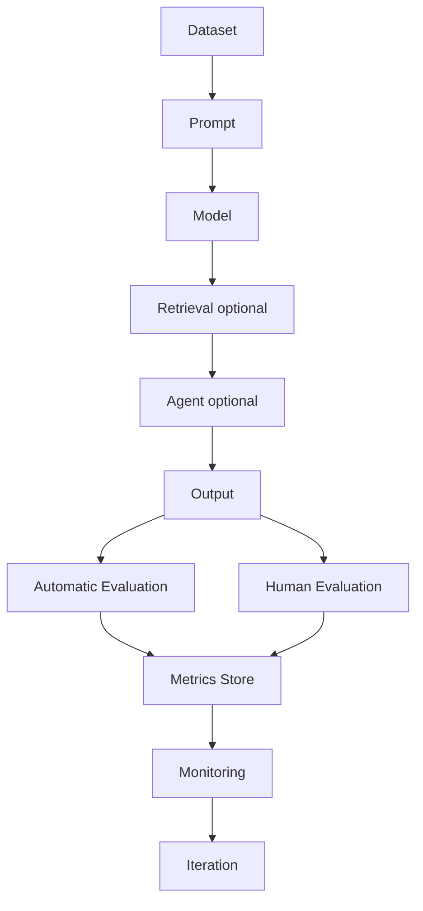
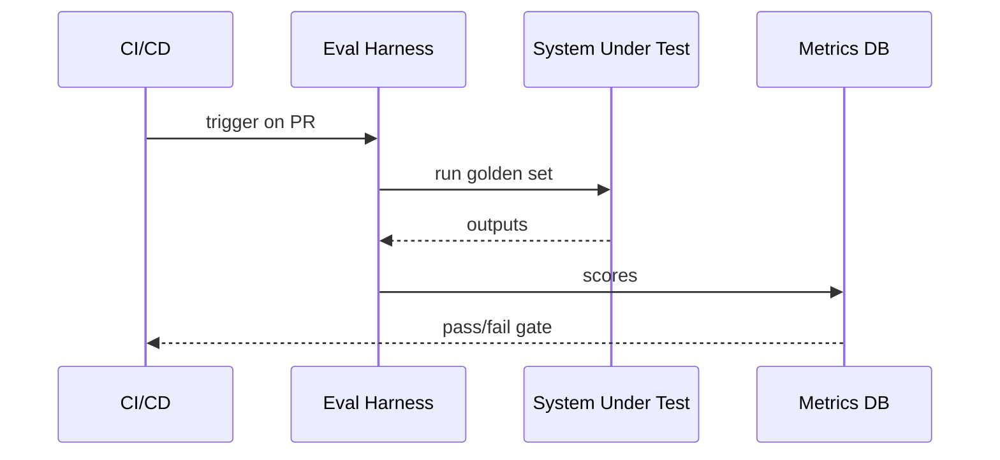

# Evaluation Architecture

## Overview

Section **2**. The evaluation pipeline spans data, execution, scoring, and feedback loops.



## Stage Responsibilities

| Stage | Responsibility |
|-------|----------------|
| **Dataset** | Versioned inputs + ground truth |
| **Prompt** | Template version pinned in run |
| **Model** | Model ID, temperature, params |
| **Retrieval** | Index version, top-k, reranker |
| **Agent** | Tool config, max steps |
| **Output** | Raw + structured captures |
| **Auto eval** | Metrics, LLM-judge, rules |
| **Human eval** | Rubrics, pairwise, expert review |
| **Metrics** | Time-series + run comparisons |
| **Monitoring** | Alerts, dashboards |
| **Iteration** | Fix prompts, data, retrieval |

## Offline Pipeline



## Online Pipeline

Sample production requests → async scoring → aggregate dashboards → alert on regression.

## Production Considerations

- Correlation IDs link traces to eval scores
- Store prompt/model/index versions per run
- Separate eval environments from prod data when needed

## Reliability

- Idempotent eval runs for retries
- Deterministic seeds where possible for regression

## Cost

- Batch offline runs; cache LLM-judge calls
- Stratified online sampling

## Best Practices

- One harness per system type (RAG, agent, chat)
- Unified metrics schema across teams

## Anti-Patterns

- Ad-hoc notebooks as only eval system
- No version metadata on runs

## Python Example

```python
@dataclass
class EvalRun:
    run_id: str
    system_version: str
    dataset_version: str
    scores: dict[str, float]

async def run_eval_harness(cases: list, system_fn) -> EvalRun:
    outputs = [await system_fn(c.input) for c in cases]
    scores = compute_metrics(outputs, cases)
    return EvalRun(run_id=uuid4().hex, system_version="v1", dataset_version="golden-v3", scores=scores)
```

## Interview Preparation

**Q: Design eval architecture for enterprise RAG.**

> Golden sets per domain, nightly RAGAS runs, sampled online faithfulness checks, dashboard with retrieval + gen metrics, CI gate on PR, human review queue for low scores.

## Navigation

- [Evaluation Datasets](evaluation-datasets.md) · [Production Evaluation](production-evaluation.md)

---

## Changelog

| Version | Date | Changes |
|---------|------|---------|
| 1.0 | 2026-07-13 | Initial publication |
