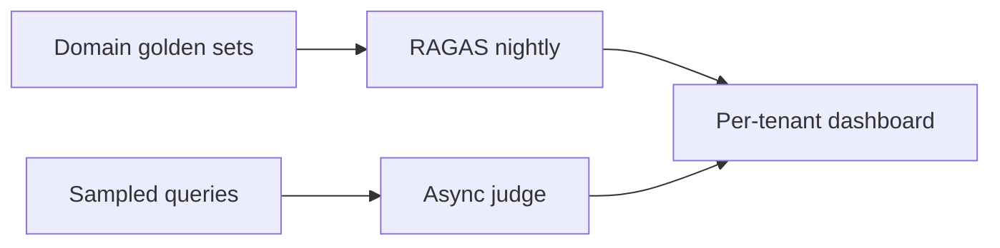

# Real-World Evaluation Case Studies

## Overview

Section **20** — engineering patterns (not proprietary implementations).

---

## 1. Conversational AI (ChatGPT-class)

| Dimension | Pattern |
|-----------|---------|
| **Quality** | Human preference + model grader |
| **Safety** | Red-team adversarial sets |
| **Online** | Thumbs + sampled review |
| **Scale** | Tiered eval by risk class |

---

## 2. GitHub Copilot (Coding Assistant)

| Dimension | Pattern |
|-----------|---------|
| **Correctness** | Unit test pass rate on generated code |
| **Latency** | TTFT critical for IDE UX |
| **Regression** | Language-specific golden repos |
| **Privacy** | No prod code in eval logs |

---

## 3. AI Search

- Retrieval NDCG + answer faithfulness
- Citation accuracy mandatory
- Latency budget < 2s P95

---

## 4. Enterprise RAG

- Per-tenant ACL in eval data
- Human review on low faithfulness

---

## 5. Coding Agents

- SWE-bench-style task completion
- Tool trace vs golden trajectory
- Sandbox test execution

---

## 6. Customer Support AI

- Resolution rate (human verified)
- Escalation rate
- CSAT correlation

---

## 7. Research Assistants

- Citation hallucination checks
- Source coverage rubric
- Long-context faithfulness

## Navigation

- [Comparison Guides](ai-evaluation-comparison-guides.md) · [Hub](README.md)

---

## Changelog

| Version | Date | Changes |
|---------|------|---------|
| 1.0 | 2026-07-13 | Initial publication |
