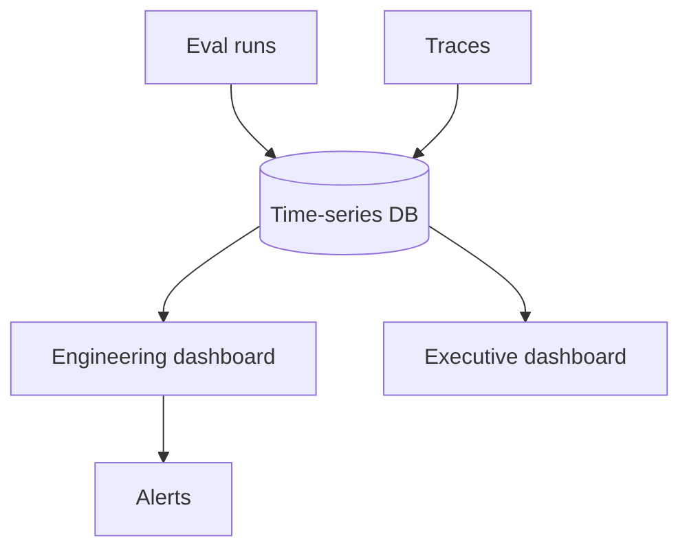

# Evaluation Dashboards

## Overview

Section **17** of Phase 10.

## Dashboard Layers

| Layer | Audience | Metrics |
|-------|----------|---------|
| **Quality** | ML/AI engineers | Faithfulness, task success, tool accuracy |
| **Latency** | Platform | P95 E2E, TTFT, retrieval |
| **Cost** | FinOps | $/request, $/task |
| **Reliability** | SRE | Error rate, timeouts |
| **Trends** | All | Week-over-week deltas |
| **Executive** | Leadership | Success rate, CSAT proxy, cost |

## Engineering Dashboard Panels

- Golden set scores by version
- Failure bucket pie chart
- Retrieval vs generation metric split
- Agent tool error rate

## Executive Dashboard Panels

- Task completion rate
- Cost per successful interaction
- Incident-linked quality drops

## Production Considerations

- Role-based access to raw outputs (PII)
- Link dashboard drill-down to traces

## Navigation

- [Production Evaluation](production-evaluation.md)

---

## Changelog

| Version | Date | Changes |
|---------|------|---------|
| 1.0 | 2026-07-13 | Phase 10 Section 17 |
