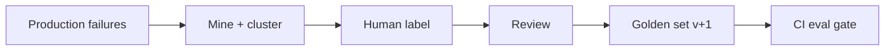

# Evaluation Datasets

## Overview

Section **3**. Datasets are the foundation of reproducible evaluation.

## Dataset Types

| Type | Purpose | Example |
|------|---------|---------|
| **Golden** | Regression + acceptance | 200 curated support Q&A |
| **Test** | Hold-out for tuning | Dev split |
| **Benchmark** | External comparison | MMLU subset |
| **Synthetic** | Scale coverage | LLM-generated edge cases |
| **Adversarial** | Security / jailbreak | Prompt injection attempts |
| **Edge-case** | Rare failures | Empty input, huge docs |

## Versioning

```
datasets/
  support-golden/
    v1.0.0/
      cases.jsonl
      manifest.yaml   # schema, hash, author
```

Pin `dataset_version` in every eval run.

## Ground Truth Creation

1. Mine production failures → label
2. Expert annotation with guidelines
3. Inter-annotator agreement (Cohen's kappa)
4. Adjudication for disagreements

## Data Quality Checklist

- [ ] Representative of production distribution
- [ ] Balanced difficulty tiers
- [ ] Documented labeling rubric
- [ ] No train/test leakage from fine-tuning data
- [ ] PII scrubbed

## Production Workflow



## Cost Considerations

- Human labeling is expensive — prioritize high-impact buckets
- Synthetic data cheap but validate against human subset

## Anti-Patterns

- Stale golden set never updated
- Single annotator without review

## Python Example

```python
def write_jsonl(cases: list[dict], path: str) -> None:
    with open(path, "w") as f:
        for c in cases:
            f.write(json.dumps(c) + "\n")
```

## Navigation

- [Core Metrics](core-metrics.md) · [Benchmarking](benchmarking.md)

---

## Changelog

| Version | Date | Changes |
|---------|------|---------|
| 1.0 | 2026-07-13 | Initial publication |
