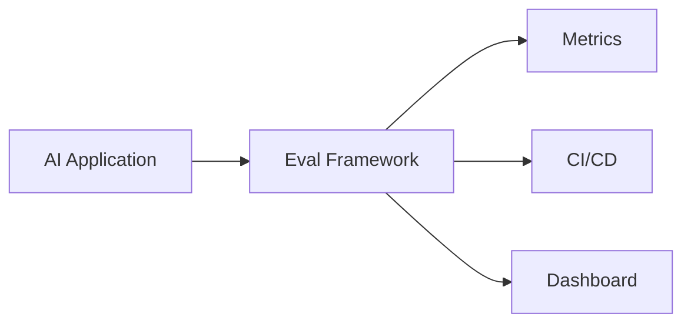

# Evaluation Frameworks

## Overview

Section **10** of Phase 10. Framework guides for implementation.

## Framework Comparison

| Framework | Best for | Integration | Limitations |
|-----------|----------|-------------|-------------|
| **RAGAS** | RAG metrics | Python, datasets | LLM judge cost |
| **DeepEval** | CI/CD, custom metrics | Pytest-style | Learning curve |
| **LangSmith** | LangChain apps | Hosted traces + eval | Vendor lock-in |
| **Phoenix** | Observability + eval | Arize, traces | Ops setup |
| **OpenAI Evals** | OpenAI models | Eval registry | OpenAI-centric |

## Framework Guides

| Guide | Document |
|-------|----------|
| RAGAS | [frameworks/ragas.md](frameworks/ragas.md) |
| DeepEval | [frameworks/deepeval.md](frameworks/deepeval.md) |
| LangSmith | [frameworks/langsmith.md](frameworks/langsmith.md) |
| Phoenix | [frameworks/phoenix.md](frameworks/phoenix.md) |
| OpenAI Evals | [frameworks/openai-evals.md](frameworks/openai-evals.md) |

## Selection Guide

- **RAG pipeline** → start with RAGAS
- **Pytest in CI** → DeepEval
- **Already on LangChain** → LangSmith
- **Need traces + drift** → Phoenix
- **OpenAI-only evals** → OpenAI Evals

## Navigation

- [Human Evaluation](human-evaluation.md) · [Examples](../../examples/ai-evaluation/)

---

## Changelog

| Version | Date | Changes |
|---------|------|---------|
| 1.0 | 2026-07-13 | Phase 10 Section 10 |
