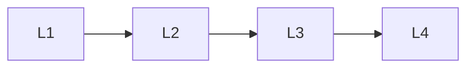

# Foundations

> Section of the **ai-evaluation** handbook.

## Lessons

| # | Lesson |
|---|--------|
| 1 | [Introduction To Ai Evaluation](01-introduction-to-ai-evaluation.md) |
| 2 | [Evaluation Architecture](02-evaluation-architecture.md) |
| 3 | [Evaluation Datasets](03-evaluation-datasets.md) |
| 4 | [Benchmarking](04-benchmarking.md) |

**Topic hub:** [../README.md](../README.md)
