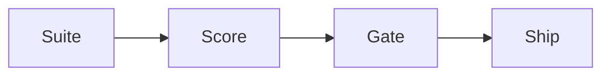

# RAGAS Evaluation Framework

> RAGAS architecture, metrics, pipelines, configuration, Python examples, production usage.

## Table of Contents

- [Overview](#overview)
- [Definition](#definition)
- [Why It Matters](#why-it-matters)
- [Uses](#uses)
- [Core Ideas](#core-ideas)
- [How It Works](#how-it-works)
- [Worked Example](#worked-example)
- [Python Examples](#python-examples)
- [Evaluation](#evaluation)
- [Production Considerations](#production-considerations)
- [Performance & Cost](#performance--cost)
- [Security Notes](#security-notes)
- [Best Practices](#best-practices)
- [Common Mistakes](#common-mistakes)
- [Interview Preparation](#interview-preparation)
- [Navigation](#navigation)

---

## Overview

Part of **Frameworks** in the **LLM Evaluation** handbook. Treat **RAGAS Evaluation Framework** as an implementable engineering topic.

**Typical workflow:** dataset → metrics → judges/human → gate → monitor.

---

## Definition

**RAGAS Evaluation Framework** — RAGAS architecture, metrics, pipelines, configuration, Python examples, production usage.

State inputs, outputs, success metrics, and failure behavior before changing production configs.

---

## Why It Matters

Gaps here show up as hallucinations, silent quality drops, runaway cost, or unsafe tool use. Clear design and measurement keep AI features shippable.

---

## Uses

| Use case | How this applies |
|----------|------------------|
| Product feature | User-facing capability with SLOs |
| Internal platform | Shared retrieval/agent/eval primitives |
| Incident response | Diagnose quality, latency, or safety regressions |
| Design review | Make tradeoffs explicit |

---

## Core Ideas

1. Separate orchestration from model calls.
2. Measure offline before widening traffic.
3. Bound loops, tokens, tools, and spend.
4. Version prompts/indexes/models/policies together.
5. Prefer cite/ground/approve over unconstrained generation when risk is high.

---

## How It Works



Assign owners to each stage (data, model, app, platform, safety). Most regressions are interface skew between stages.

---

## Worked Example

**Scenario:** Apply **RAGAS Evaluation Framework** to a production-shaped slice of traffic.

1. Write a one-page spec: inputs, outputs, SLO, safety policy, offline metrics.
2. Implement the smallest correct path with logging and timeouts.
3. Build a golden set (even 50–200 cases) and gate the change.
4. Canary 1–5% traffic; watch quality, latency, cost, and abuse.
5. Keep one-click rollback to the previous artifact bundle.

---

## Python Examples

```python
def pass_gate(scores: dict[str, float], floors: dict[str, float]) -> bool:
    return all(scores.get(k, 0.0) >= v for k, v in floors.items())

```

Wrap provider SDKs behind interfaces so unit tests do not need live keys.

---

## Evaluation

| Layer | Examples |
|-------|----------|
| Offline | Golden set, recall@k, task success, rubrics |
| Online | Thumbs, redo rate, escalation, cost/request |
| Safety | Injection, PII leak, tool-scope violations |

Ship only when offline floors pass and canary metrics stay in budget.

---

## Production Considerations

- Structured logs with request ids (redact secrets/PII).
- Feature flags for model/prompt/index swaps.
- Explicit timeouts, retries with jitter, and circuit breakers.
- Multi-tenant isolation for data and tools.

## Performance & Cost

- Track p50/p95 latency and $ per successful task.
- Cache embeddings/retrieval when invalidation is clear.
- Prefer smaller routers/classifiers in front of expensive generators.

## Security Notes

- Treat model output and tool args as untrusted until validated.
- Scope tools tightly; require approval for high-impact actions.
- Enforce authZ on retrieval filters and MCP/tool servers.

---

## Best Practices

1. Baseline → measure → complicate.
2. Keep golden sets sacred (no training on them).
3. Change one axis at a time (model **or** prompt **or** index).
4. Document failure modes users will see.
5. Practice rollback drills.

---

## Common Mistakes

- Demo prompts with no eval harness.
- Unbounded agent/tool loops.
- Missing citations for grounded answers.
- Train/serve skew in chunking or auth filters.
- Cost dashboards that ignore tool fan-out.

---

## Interview Preparation

**Q: How do you explain ragas evaluation framework in a system design interview?**

A: Goal → components → data flow → metrics → failure modes → scale knobs → security.

**Q: What do you gate on before production?**

A: Offline floors, canary online metrics, safety checks, and a tested rollback.

**Q: What breaks first in production?**

A: Usually retrieval/auth skew, prompt regressions, or cost blowups — not the happy-path demo.

---

## Navigation

- **Section hub:** [README](README.md)
- **Topic hub:** [../README.md](../README.md)
