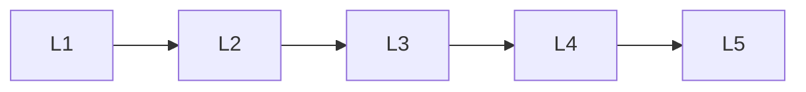

# Frameworks

> Section of the **ai-evaluation** handbook.

## Lessons

| # | Lesson |
|---|--------|
| 1 | [Deepeval](02-deepeval.md) |
| 2 | [Langsmith](03-langsmith.md) |
| 3 | [Openai Evals](04-openai-evals.md) |
| 4 | [Phoenix](05-phoenix.md) |
| 5 | [Ragas](06-ragas.md) |

**Topic hub:** [../README.md](../README.md)
