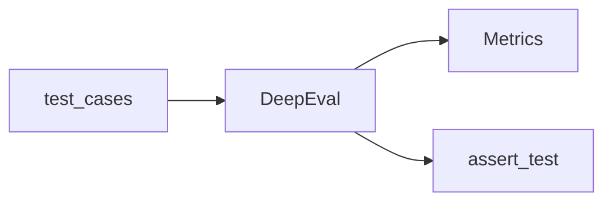

# DeepEval Evaluation Framework

## Overview

**DeepEval** provides pytest-style LLM evaluation with built-in and custom metrics.

## Pipeline



## Built-in Metrics

- Answer relevancy, faithfulness, hallucination
- Tool correctness, G-Eval

## Python Example

```python
# pip install deepeval
from deepeval import assert_test
from deepeval.test_case import LLMTestCase
from deepeval.metrics import AnswerRelevancyMetric

def test_support_answer():
    case = LLMTestCase(input="Refund policy?", actual_output="30 days with receipt.")
    metric = AnswerRelevancyMetric(threshold=0.7)
    assert_test(case, [metric])
```

## Custom Metrics

Subclass `BaseMetric` with `measure()` and `is_successful()`.

## CI Integration

Run `deepeval test run` in GitHub Actions on PR.

## Navigation

- [RAGAS](ragas.md) · [Continuous Evaluation](../continuous-evaluation.md)

---

## Changelog

| Version | Date | Changes |
|---------|------|---------|
| 1.0 | 2026-07-13 | DeepEval framework guide |
