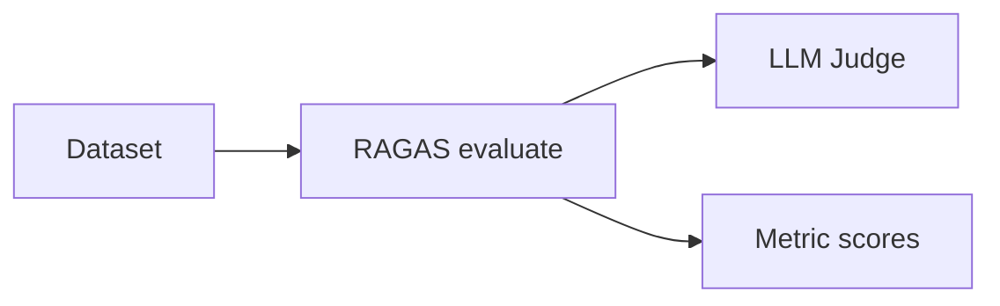

# RAGAS Evaluation Framework

## Overview

**RAGAS** (Retrieval Augmented Generation Assessment) provides reference metrics for RAG pipelines.

## Architecture



## Core Metrics

- `faithfulness` — answer grounded in context
- `answer_relevancy` — addresses question
- `context_precision` — relevant chunks ranked high
- `context_recall` — ground truth covered

## Python Example

```python
# pip install ragas datasets
from datasets import Dataset
from ragas import evaluate
from ragas.metrics import faithfulness, answer_relevancy, context_precision

data = Dataset.from_dict({
    "question": ["What is the refund policy?"],
    "answer": ["Refunds within 30 days."],
    "contexts": [["Refunds accepted within 30 days with receipt."]],
    "ground_truth": ["30-day refund policy"],
})
result = evaluate(data, metrics=[faithfulness, answer_relevancy, context_precision])
print(result)
```

## Production Usage

- Nightly batch on golden set
- Pin RAGAS + judge model versions
- Sample online traffic for async eval

## Limitations

- Judge model bias and cost
- Needs well-formed dataset columns

## Navigation

- [DeepEval](deepeval.md) · [RAG Evaluation](../rag-evaluation.md)

---

## Changelog

| Version | Date | Changes |
|---------|------|---------|
| 1.0 | 2026-07-13 | RAGAS framework guide |
