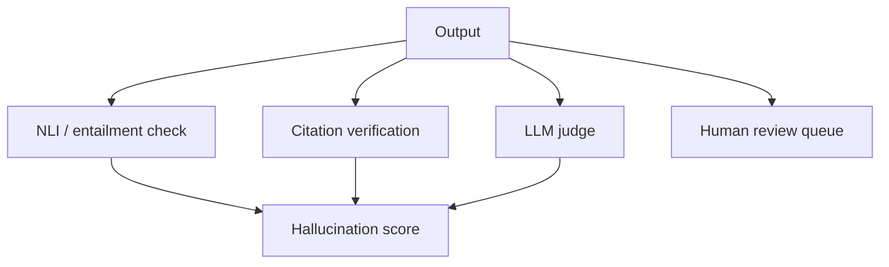

# Hallucination Detection

## Overview

Section **6**.

## Hallucination Types

| Type | Description | Common in |
|------|-------------|-----------|
| **Retrieval** | Ignores or misuses retrieved context | RAG |
| **Reasoning** | Invalid logical steps | Agents, CoT |
| **Citation** | Fake or wrong sources | RAG with citations |
| **Fabrication** | Invented entities/facts | Open QA |
| **Unsupported claims** | Plausible but unverifiable | Summaries |

## Detection Strategies



| Strategy | Pros | Cons |
|----------|------|------|
| **NLI entailment** | Fast | brittle on long context |
| **LLM-as-judge** | Flexible | Cost, bias |
| **Citation match** | Objective for RAG | Needs structured cites |
| **Human review** | Gold standard | Slow |

## Confidence Estimation

- Token logprobs (when available)
- Self-consistency across samples
- Retrieval score thresholds → abstain

## Production Workflow

1. Auto-score all outputs in eval
2. Route low faithfulness to human queue
3. Cluster failure modes → fix retrieval or prompt

## Python Example

```python
def citation_hallucination(answer: str, valid_ids: set[str]) -> list[str]:
    import re
    cited = set(re.findall(r"\[(\d+)\]", answer))
    return list(cited - valid_ids)
```

## Navigation

- [RAG Evaluation](rag-evaluation.md)

---

## Changelog

| Version | Date | Changes |
|---------|------|---------|
| 1.0 | 2026-07-13 | Initial publication |
