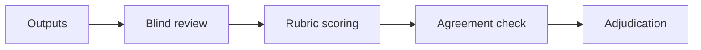

# Human Evaluation

## Overview

Section **11** of Phase 10.

## Methods

| Method | Use case |
|--------|----------|
| **Likert rubric** | 1–5 helpfulness, safety |
| **Pairwise** | Compare prompt A vs B |
| **Blind evaluation** | Hide model/source |
| **Expert review** | Domain specialists |

## Annotation Workflow

1. Guidelines doc with examples
2. Pilot round + calibration
3. Dual annotation on sample
4. Measure Cohen's kappa
5. Adjudicate disagreements

## Bias Reduction

- Randomize order in pairwise
- Hide brand/model names
- Rotate annotators across slices

## Production Considerations

- Cost: ~$1–5 per complex example
- Queue low auto-score cases first

## Anti-Patterns

- Single annotator, no guidelines
- Evaluators see their own system's label

## Navigation

- [Latency Evaluation](latency-evaluation.md)

---

## Changelog

| Version | Date | Changes |
|---------|------|---------|
| 1.0 | 2026-07-13 | Phase 10 Section 11 |
