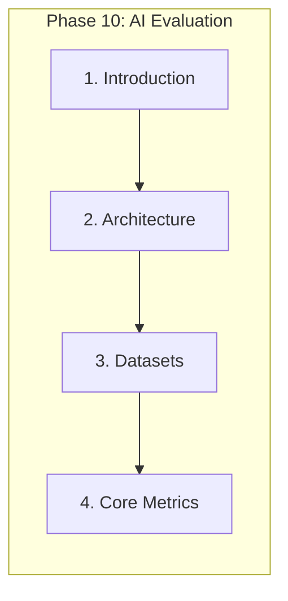
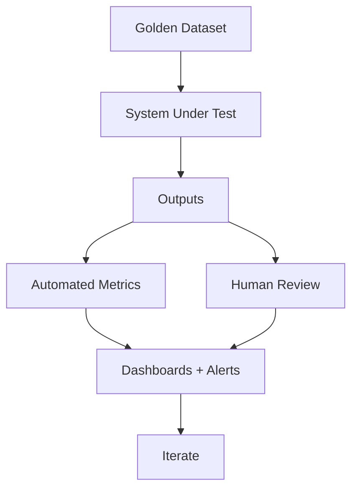

# Introduction to AI Evaluation

> AI evaluation is an engineering discipline for measuring, validating, comparing, monitoring, and continuously improving production AI systems — not simply calculating model accuracy.

## Table of Contents

- [Overview](#overview)
- [What Is AI Evaluation?](#what-is-ai-evaluation)
- [Why Evaluation Matters](#why-evaluation-matters)
- [Offline vs Online Evaluation](#offline-vs-online-evaluation)
- [Continuous Evaluation](#continuous-evaluation)
- [Evaluation Lifecycle](#evaluation-lifecycle)
- [Evaluation-Driven Development](#evaluation-driven-development)
- [LLMOps Overview](#llmops-overview)
- [Evaluation Architecture](#evaluation-architecture)
- [Common Misconceptions](#common-misconceptions)
- [Engineering Motivation](#engineering-motivation)
- [Production Considerations](#production-considerations)
- [Best Practices](#best-practices)
- [Anti-Patterns](#anti-patterns)
- [Python Examples](#python-examples)
- [Interview Preparation](#interview-preparation)
- [Navigation](#navigation)

---

## Overview

**AI evaluation** measures whether LLM-powered systems — prompts, RAG pipelines, agents, MCP workflows — meet quality, reliability, latency, cost, and business requirements in production.

Section **1** of Phase 10.



> **Prerequisites:** [Phase 9 MCP](../mcp/README.md) · [Phase 8 Agents](../ai-agents/README.md) · [Phase 7 RAG](../rag/README.md) · [Prompt Evaluation](../prompt-engineering/prompt-evaluation.md)

---

## What Is AI Evaluation?

| Scope | What you evaluate |
|-------|-------------------|
| **LLM** | Correctness, coherence, safety |
| **Prompt** | Consistency, robustness, regression |
| **RAG** | Retrieval + generation quality |
| **Agent** | Task completion, tool accuracy |
| **MCP** | Tool success, protocol reliability |
| **System** | Latency, cost, UX, business KPIs |



---

## Why Evaluation Matters

Without evaluation, AI systems degrade silently — prompt changes break edge cases, retrieval drifts, agents misuse tools, costs spike. Evaluation provides:

- **Regression gates** before deploy
- **Comparisons** across models and prompts
- **Production monitoring** for drift
- **Accountability** for business and compliance

---

## Offline vs Online Evaluation

| Mode | When | Data | Risk |
|------|------|------|------|
| **Offline** | Pre-deploy, CI | Golden sets, benchmarks | Misses live distribution |
| **Online** | Production | Sampled traffic, A/B tests | User impact if misconfigured |

Use both: offline for fast iteration; online for ground truth on real usage.

---

## Continuous Evaluation

Scheduled runs on golden sets + sampled production logs detect:

- Model version regressions
- Prompt template drift
- Retrieval index staleness
- Agent tool failure rate increases

See [Continuous Evaluation](continuous-evaluation.md).

---

## Evaluation Lifecycle

1. Define success criteria (task + business)
2. Build/version datasets
3. Instrument system (traces, costs)
4. Run automated + human eval
5. Analyze, compare, decide
6. Deploy with monitoring
7. Repeat on schedule and on change

---

## Evaluation-Driven Development

Treat eval harnesses like test suites:

- Add a failing case for every production bug
- Block merge if critical metrics drop
- Version datasets with code and prompts

---

## LLMOps Overview

LLMOps extends MLOps for generative systems:

| Pillar | Evaluation role |
|--------|-----------------|
| **Versioning** | Prompt, model, index versions in eval runs |
| **CI/CD** | Eval gates in pipeline |
| **Observability** | Online metrics feed dashboards |
| **Governance** | Audit trails for human + auto scores |

---

## Evaluation Architecture

See [Evaluation Architecture](evaluation-architecture.md) for the full pipeline: dataset → system → metrics → monitoring → iteration.

---

## Common Misconceptions

| Misconception | Reality |
|---------------|---------|
| "BLEU is enough" | Semantic tasks need LLM-judge or task metrics |
| "One benchmark proves quality" | Benchmarks ≠ your users |
| "Eval is a one-time activity" | Continuous eval required in production |
| "Higher accuracy = better product" | Latency, cost, UX matter equally |

---

## Engineering Motivation

Evaluation is how AI engineering becomes **engineering** — measurable, repeatable, improvable.

---

## Production Considerations

- Sample rate for online eval (cost vs coverage)
- PII handling in logged outputs
- Eval compute budget (LLM-as-judge costs)

---

## Best Practices

1. Start with task-specific golden sets
2. Combine automated + human eval
3. Track latency and cost alongside quality
4. Version everything in eval runs

---

## Anti-Patterns

| Anti-Pattern | Why |
|--------------|-----|
| Evaluating only on demo queries | False confidence |
| Optimizing to public benchmarks only | Overfitting |
| No regression suite | Repeat incidents |

---

## Python Examples

```python
@dataclass
class EvalCase:
    id: str
    input: str
    expected: str | None
    tags: list[str]

def load_golden_set(path: str) -> list[EvalCase]:
    return [EvalCase(**row) for row in json.load(open(path))]
```

---

## Interview Preparation

**Q: Offline vs online evaluation?**

> Offline uses fixed datasets pre-deploy for fast regression. Online samples production traffic for real distribution, drift detection, and A/B tests — slower, costlier, but ground truth on live behavior.

**Q: How do you evaluate a RAG system?**

> Separate retrieval metrics (context precision/recall) from generation metrics (faithfulness, answer relevance). Use frameworks like RAGAS plus human review on failure buckets.

---

## Navigation

### Prerequisites

- [RAG Evaluation](../rag/rag-evaluation.md) · [Agent Evaluation](../ai-agents/agent-evaluation.md)

### Next

- [Evaluation Architecture](evaluation-architecture.md)

### Unlocks

- Production AI · Observability · Continuous improvement

---

## Changelog

| Version | Date | Changes |
|---------|------|---------|
| 1.0 | 2026-07-13 | Phase 10 Section 1 |
