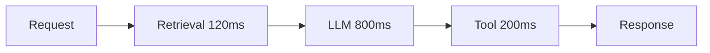

# Latency Evaluation

## Overview

Section **12**.

## Latency Types

| Metric | Definition |
|--------|------------|
| **E2E latency** | Request → final response |
| **TTFT** | Time to first token (streaming) |
| **Retrieval latency** | Embed + search + rerank |
| **Tool latency** | MCP / API call duration |
| **Agent latency** | Full multi-step workflow |



## Percentiles

Report **P50, P95, P99** — mean hides tail latency.

## Performance Budgets

| Tier | E2E target |
|------|--------------|
| Chat | < 3s P95 |
| RAG Q&A | < 5s P95 |
| Agent task | < 30s P95 |

## Python Example

```python
import time
from contextlib import contextmanager

@contextmanager
def timer(bucket: dict, name: str):
    start = time.perf_counter()
    yield
    bucket[name] = (time.perf_counter() - start) * 1000

# usage: with timer(latencies, "retrieval"): ...
```

## Navigation

- [Cost Evaluation](cost-evaluation.md)

---

## Changelog

| Version | Date | Changes |
|---------|------|---------|
| 1.0 | 2026-07-13 | Initial publication |
