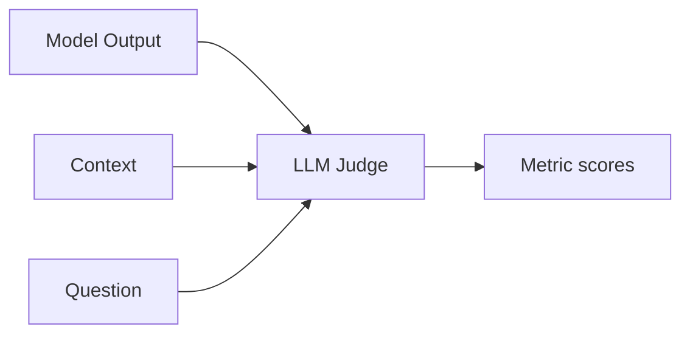

# LLM Evaluation Metrics

## Overview

Section **5** of Phase 10. LLM-specific metrics capture semantic quality beyond n-gram overlap.

## Metric Catalog

| Metric | Definition | Measurement |
|--------|------------|-------------|
| **Faithfulness** | Claims supported by context | LLM-judge / NLI |
| **Relevance** | Answers the question | LLM-judge |
| **Correctness** | Factually true (world) | Human / tools |
| **Helpfulness** | Useful to user | Human rating 1–5 |
| **Completeness** | All parts addressed | Rubric checklist |
| **Consistency** | Same answer across runs | Multi-sample variance |
| **Coherence** | Logical flow | LLM-judge |
| **Groundedness** | Tied to provided sources | Citation match |
| **Toxicity** | Harmful content | Classifier |
| **Safety** | Policy compliance | Rule + judge |
| **Instruction following** | Adheres to format/rules | Schema + judge |
| **Tool accuracy** | Right tool + args | Trace validation |



## Engineering Guidance

- **Faithfulness** — critical for RAG; auto + human on failures
- **Tool accuracy** — parse traces; compare to golden tool calls
- **Instruction following** — validate JSON schema first (cheap), then judge
- **Consistency** — run N samples; flag high variance prompts

## Production Considerations

- LLM-judge costs scale with dataset size
- Cache judge prompts; use smaller judge model

## Anti-Patterns

- One generic "quality" score without decomposition
- Judge same model as system under test without blind review

## Python Example

```python
async def score_faithfulness(answer: str, context: str, judge_fn) -> float:
    prompt = f"Context:\n{context}\n\nAnswer:\n{answer}\n\nRate faithfulness 0-1."
    return float(await judge_fn(prompt))
```

## Navigation

- [Hallucination Detection](hallucination-detection.md) · [RAG Evaluation](rag-evaluation.md)

---

## Changelog

| Version | Date | Changes |
|---------|------|---------|
| 1.0 | 2026-07-13 | Phase 10 Section 5 |
