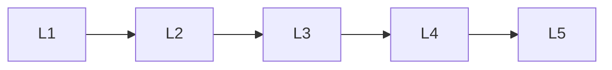

# Metrics

> Section of the **ai-evaluation** handbook.

## Lessons

| # | Lesson |
|---|--------|
| 1 | [Core Metrics](01-core-metrics.md) |
| 2 | [Llm Evaluation Metrics](02-llm-evaluation-metrics.md) |
| 3 | [Hallucination Detection](03-hallucination-detection.md) |
| 4 | [Latency Evaluation](04-latency-evaluation.md) |
| 5 | [Cost Evaluation](05-cost-evaluation.md) |

**Topic hub:** [../README.md](../README.md)
