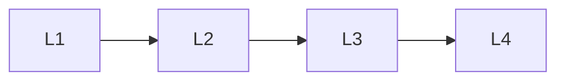

# Online Systems

> Section of the **ai-evaluation** handbook.

## Lessons

| # | Lesson |
|---|--------|
| 1 | [Ab Testing](01-ab-testing.md) |
| 2 | [Continuous Evaluation](02-continuous-evaluation.md) |
| 3 | [Production Evaluation](03-production-evaluation.md) |
| 4 | [Evaluation Dashboards](04-evaluation-dashboards.md) |

**Topic hub:** [../README.md](../README.md)
