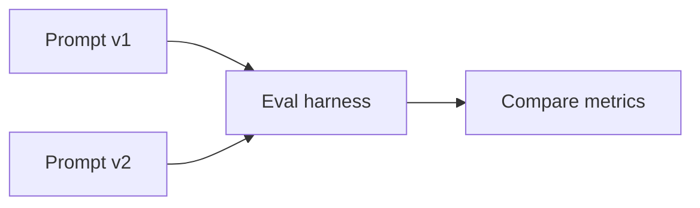

# Prompt Evaluation

## Overview

Section **8** of Phase 10. Complements [Prompt Engineering evaluation](../prompt-engineering/prompt-evaluation.md) with system-level LLMOps focus.

## Dimensions

| Dimension | Test approach |
|-----------|---------------|
| **Consistency** | Same input, N runs — variance |
| **Robustness** | Paraphrased inputs |
| **Sensitivity** | Perturb instructions |
| **Determinism** | temperature=0 stability |
| **Token efficiency** | Tokens per successful task |
| **Regression** | Golden set vs baseline prompt |
| **Comparison** | A/B prompt variants |



## Prompt Quality Metrics

- Task success rate on golden set
- Instruction-following pass rate
- Average output length / tokens
- Failure category distribution

## Production Workflow

- Pin prompt version in eval manifest
- CI fails if success rate drops > X%
- Canary new prompt on 5% traffic

## Anti-Patterns

- Tweaking prompt to pass benchmark only
- No paraphrase tests

## Python Example

```python
async def prompt_regression(baseline_fn, candidate_fn, cases: list) -> dict:
    base = sum(1 for c in cases if await baseline_fn(c)) / len(cases)
    cand = sum(1 for c in cases if await candidate_fn(c)) / len(cases)
    return {"baseline": base, "candidate": cand, "delta": cand - base}
```

## Navigation

- [Agent Evaluation](agent-evaluation.md)

---

## Changelog

| Version | Date | Changes |
|---------|------|---------|
| 1.0 | 2026-07-13 | Phase 10 Section 8 |
