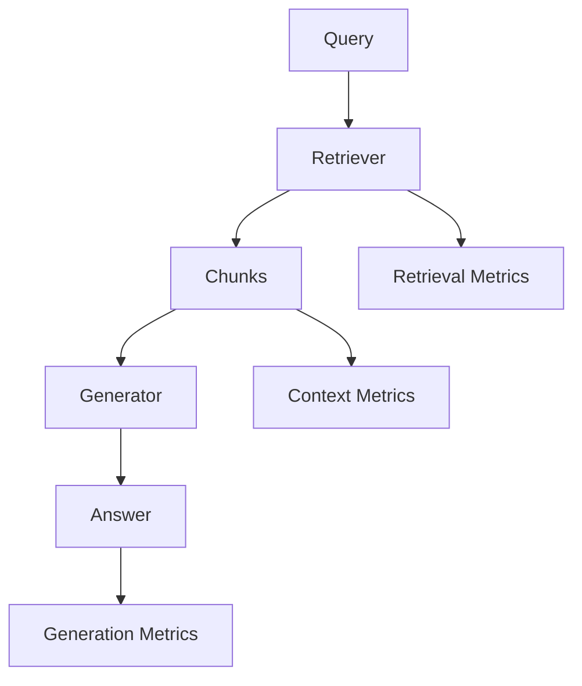

# RAG System Evaluation

## Overview

Section **7** of Phase 10 — largest evaluation topic for retrieval-augmented systems.



## Metrics

| Metric | Layer | Measures |
|--------|-------|----------|
| **Retrieval Precision@k** | Retrieval | Relevant in top-k |
| **Retrieval Recall@k** | Retrieval | Found all relevant |
| **Context Precision** | Context | Useful chunks in context |
| **Context Recall** | Context | Ground truth covered |
| **Faithfulness** | Generation | Answer from context |
| **Answer Relevance** | Generation | Addresses query |
| **Context Relevance** | Context | Chunks on-topic |
| **Citation accuracy** | Generation | Correct source refs |
| **Chunk quality** | Index | Size, coherence |
| **Retrieval latency** | Ops | p95 embed+search |
| **Ranking quality** | Retrieval | MRR, NDCG |

## Frameworks

| Framework | Strength |
|-----------|----------|
| **RAGAS** | Standard RAG metric suite |
| **ARES** | Automated RAG eval |
| **DeepEval** | Custom + CI integration |

See [RAGAS Guide](frameworks/ragas.md) · [DeepEval Guide](frameworks/deepeval.md).

## Evaluation Workflow

1. Golden set: question + ground_truth + relevant_doc_ids
2. Run pipeline; log retrieved chunks
3. Compute retrieval + generation metrics
4. Slice by domain/difficulty
5. Gate deploy on faithfulness + relevance thresholds

## Production Considerations

- Online: sample queries, async RAGAS on subset
- Track index version per eval run

## Python Example

```python
def retrieval_recall_at_k(retrieved_ids: list[str], gold_ids: set[str], k: int) -> float:
    top = set(retrieved_ids[:k])
    if not gold_ids:
        return 1.0
    return len(top & gold_ids) / len(gold_ids)
```

## Interview Preparation

**Q: RAG eval when you lack labeled relevant docs?**

> Use LLM-judge context precision, human labeling on sampled failures, production mining to build gold doc IDs over time.

## Navigation

- [Prompt Evaluation](prompt-evaluation.md) · [RAG Domain](../rag/rag-evaluation.md)

---

## Changelog

| Version | Date | Changes |
|---------|------|---------|
| 1.0 | 2026-07-13 | Phase 10 Section 7 |
