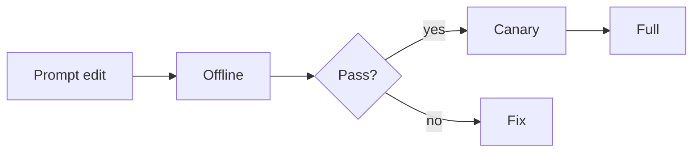

# Prompt Evaluation

> Treat prompts like code: version them, test them on a frozen suite, and canary them in production.

## What you evaluate

| Change | Risks |
|--------|-------|
| System prompt | Tone, refusals, tool policy |
| Few-shot set | Overfit style, leakage |
| Output schema | Parse failures |
| Model swap | Silent behavior shift |

## Golden set design

- 50–500 cases covering intents, edge cases, and safety.
- Frozen expected behaviors (keywords, JSON schema, rubric scores).
- Separate **smoke** (PR) and **full** (nightly) suites.

```python
CASES = [
    {"id": "refund_policy", "input": "Can I get a refund after 40 days?", "expect_contains": ["30 days"]},
    {"id": "json_ok", "input": "Return JSON with field n", "schema": {"type": "object", "required": ["n"]}},
]
```

## Process



## Online

Track thumbs, regenerate rate, and escalation after prompt releases. Auto-rollback if floors break.

## Mistakes

- Editing prompts directly in prod config with no suite.
- Judging from 3 manual chats.
- Sharing golden cases into training data for FT.

## Interview

**Q: How do you A/B prompts?** Split traffic, pre-register primary metric, watch safety guardrails, stop early on regressions.


## Diff-based review

Always store prompt text in git. PR diffs should show system prompt changes next to suite results.

## Flaky cases

Pin temperature=0 for deterministic checks; keep a separate creative suite with tolerances.

## Tie-in to PE handbook

Operational detail lives in [Prompt Testing](../../prompt-engineering/prompt-operations/03-prompt-testing.md) and [Prompt Versioning](../../prompt-engineering/prompt-operations/02-prompt-versioning.md).

## Navigation

- [RAG evaluation](02-rag-evaluation.md) · [Core metrics](../metrics/01-core-metrics.md)
- [Prompt testing](../../prompt-engineering/prompt-operations/03-prompt-testing.md)
- [Section hub](README.md) · [Eval hub](../README.md)
