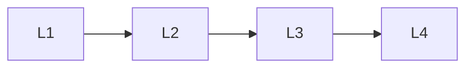

# Surface Areas

> Section of the **ai-evaluation** handbook.

## Lessons

| # | Lesson |
|---|--------|
| 1 | [Prompt Evaluation](01-prompt-evaluation.md) |
| 2 | [Rag Evaluation](02-rag-evaluation.md) |
| 3 | [Agent Evaluation](03-agent-evaluation.md) |
| 4 | [Human Evaluation](04-human-evaluation.md) |

**Topic hub:** [../README.md](../README.md)
