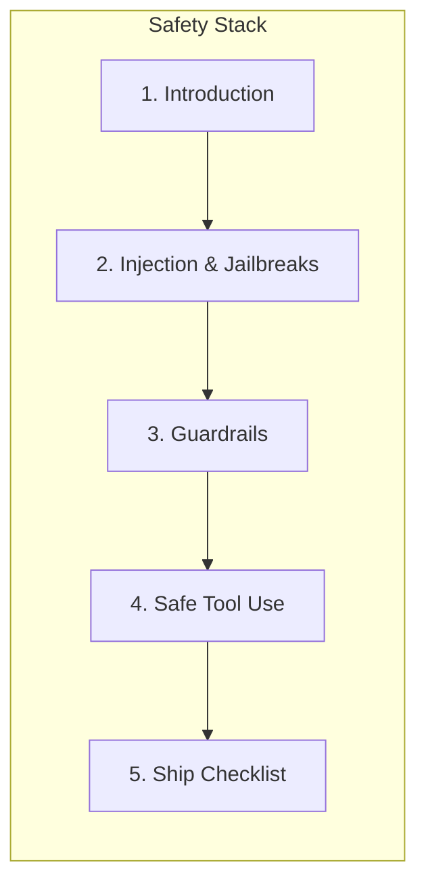

# AI Safety

> Engineering handbook for shipping AI systems that resist prompt injection, data leakage, harmful outputs, and unsafe tool use.
> **Related:** [Prompt Security](../prompt-engineering/prompt-security.md) · [Security](../security/README.md) · [AI Agents](../ai-agents/README.md) · [MCP](../mcp/README.md)

---

## Module Overview

AI safety for engineers is **defense-in-depth around prompts, models, tools, and outputs** — not research alignment theory. Every untrusted string that enters context can change behavior; every tool call can change the world.

**Unlocks:** Production agents, MCP integrations, and customer-facing LLM products with enforceable safety boundaries.

---

## Documents

| # | Document | Status | Description |
|---|----------|--------|-------------|
| 1 | [Introduction to AI Safety](introduction-to-ai-safety.md) | Published | Why AI safety matters for engineers — injection, leakage, harmful outputs, tool abuse |
| 2 | [Prompt Injection and Jailbreaks](prompt-injection-and-jailbreaks.md) | Published | Attack patterns, defenses, input/output filtering |
| 3 | [Guardrails and Content Filtering](guardrails-and-content-filtering.md) | Published | Layered pre-check / model / post-check architecture and PII redaction |
| 4 | [Safe Tool Use](safe-tool-use.md) | Published | Allowlists, human-in-the-loop, least privilege for agent tools |
| 5 | [Production AI Safety Checklist](production-ai-safety-checklist.md) | Published | Ship checklist for production AI systems |

---

## Learning Path

1. Start with [Introduction to AI Safety](introduction-to-ai-safety.md) for the threat map.
2. Harden prompts with [Prompt Injection and Jailbreaks](prompt-injection-and-jailbreaks.md) and [Prompt Security](../prompt-engineering/prompt-security.md).
3. Add runtime layers via [Guardrails and Content Filtering](guardrails-and-content-filtering.md).
4. Constrain agents and MCP tools with [Safe Tool Use](safe-tool-use.md).
5. Gate releases with the [Production AI Safety Checklist](production-ai-safety-checklist.md).

---

## Related Domains

| Domain | Why it matters |
|--------|----------------|
| [Prompt Engineering](../prompt-engineering/README.md) | Prompt hardening and injection defenses |
| [Security](../security/README.md) | AuthN/AuthZ, backend hardening, secrets |
| [AI Agents](../ai-agents/README.md) | Tool permissions, HITL, agent security |
| [MCP](../mcp/README.md) | Protocol-level tool and resource security |
| [AI Deployment](../ai-deployment/README.md) | Production security and observability |

## Templates

When adding content to this domain, use the appropriate [template](../../meta/templates/):

- Concept → `concept.md`
- Technology → `technology.md`
- Tutorial → `tutorial.md`
- Production Guide → `production-guide.md`

## See Also

- [Master Index](../../meta/indexes/MASTER-INDEX.md)
- [Learning Roadmap](../../meta/roadmap.md)
- [Contributing Guide](../../CONTRIBUTING.md)
