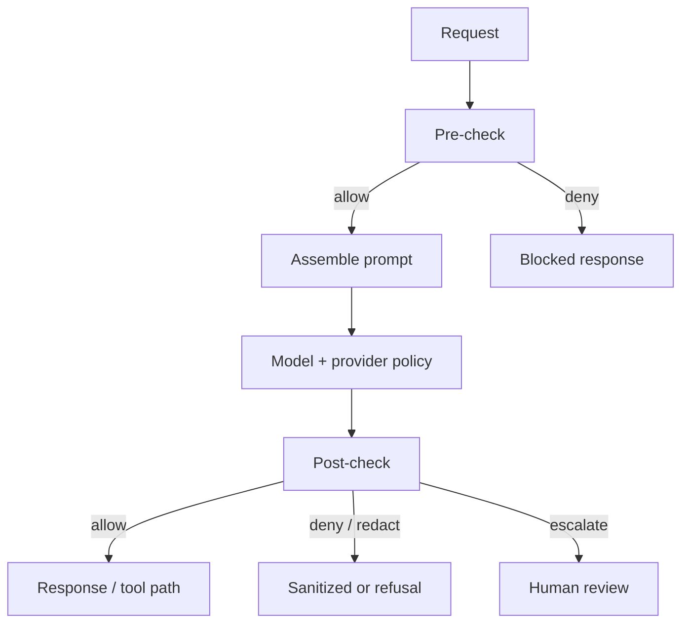
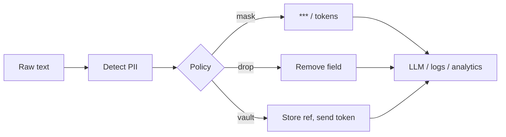

# Guardrails and Content Filtering

> Guardrails are **enforceable policies around the model**, not vibes in the system prompt. Build them as a layered pipeline with clear fail-closed behavior.

## Table of Contents

- [Layered Architecture](#layered-architecture)
- [Pre-Check](#pre-check)
- [Model-Level Controls](#model-level-controls)
- [Post-Check](#post-check)
- [PII Redaction](#pii-redaction)
- [Fail Modes and UX](#fail-modes-and-ux)
- [Implementation Sketch](#implementation-sketch)
- [Practical Takeaways](#practical-takeaways)
- [Common Mistakes](#common-mistakes)
- [Navigation](#navigation)

---

## Layered Architecture



| Layer | Runs when | Typical jobs |
|-------|-----------|--------------|
| **Pre-check** | Before LLM call | Auth, quotas, input moderation, PII strip for context |
| **Model** | During generation | System policy, safety-tuned models, structured outputs |
| **Post-check** | After tokens (or per chunk) | Toxicity, secrets, grounding, schema, tool arg policy |

Injection-specific filters belong with [Prompt Injection and Jailbreaks](prompt-injection-and-jailbreaks.md); tool gates with [Safe Tool Use](safe-tool-use.md).

---

## Pre-Check

### Always

- Authenticate and authorize the caller ([Security for AI Backends](../security/security-for-ai-backends.md))
- Enforce rate limits and max request size
- Reject disallowed file types / URLs

### Often

| Control | Notes |
|---------|-------|
| Input moderation API | Fast reject of clear policy violations |
| Prompt-injection heuristics | Signal only; combine with structure |
| Allowlisted languages / topics | Product-scoped assistants |
| Context budget caps | Truncate rather than send huge dumps |

Pre-check should be **cheap and fail-closed** for hard policy (auth, size). Soft classifiers can soft-block with review.

---

## Model-Level Controls

Use the model as one layer, never the only layer:

1. **System policy** — product rules, refusal style, no tool invention
2. **Structured outputs** — JSON Schema / constrained decoding for machine-consumed replies
3. **Provider safety settings** — when available and acceptable for latency/cost
4. **Temperature / sampling** — lower creativity for high-stakes answers
5. **Separate “planner” vs “speaker” models** — optional for agents

Prompt hardening details: [Prompt Security](../prompt-engineering/prompt-security.md).

---

## Post-Check

### Content policy

- Toxicity / hate / self-harm classifiers
- Brand or vertical policy (medical disclaimer, financial advice limits)
- Jailbreak success detectors (policy-violating completions)

### Integrity

- Secret scanners (API keys, tokens)
- PII scanners before response leaves the boundary
- For RAG: grounding / citation checks when claims require sources

### Action gates

If the “output” is a tool call, post-check includes:

- Name ∈ allowlist
- Args match schema and business rules
- Destructive → HITL ([Safe Tool Use](safe-tool-use.md), [Agent Security](../ai-agents/agent-security.md), [MCP Security](../mcp/mcp-security.md))

### Streaming

Buffer or scan sliding windows; do not flush unfiltered tokens that may contain secrets mid-stream. Prefer delayed commit for high-risk channels (email send, public post).

---

## PII Redaction



| Surface | Recommendation |
|---------|----------------|
| Prompt context | Minimize; tokenize account IDs instead of raw PII when possible |
| Logs / traces | Default redact emails, phones, cards, SSNs |
| Training / eval exports | Separate pipelines with scrubbing |
| Tool args | Validate types; never log full payloads |

Detection options: regex + NER models + vendor DLP. Prefer **token replacement** (`[EMAIL_1]`) so the model can still reason without seeing raw values.

---

## Fail Modes and UX

| Outcome | When | User-visible behavior |
|---------|------|------------------------|
| Hard block | Clear policy / auth failure | Generic refusal, no model hint leakage |
| Soft block | Ambiguous classifier | Clarify ask / offer human support |
| Redact | PII or secrets in output | Show sanitized answer + optional notice |
| Escalate | High impact action | Queue for human approval |

Never echo the attack payload back in error messages.

---

## Implementation Sketch

```python
@dataclass
class GuardResult:
    allowed: bool
    reason: str | None = None
    text: str | None = None

async def handle_turn(user_id: str, text: str) -> str:
    if not await authorize(user_id):
        return "Unauthorized."

    pre = await pre_check(text)
    if not pre.allowed:
        return safe_refusal(pre.reason)

    prompt = assemble(system=SYSTEM, user=pre.text)
    raw = await llm.complete(prompt)

    post = await post_check(raw, user_id=user_id)
    if not post.allowed:
        return safe_refusal(post.reason)
    return post.text or ""
```

Wire metrics: `guard.pre.block`, `guard.post.block`, `guard.pii.redactions`.

---

## Practical Takeaways

1. **Three layers minimum** — pre, model, post.
2. **Fail closed** for auth, destructive tools, and known secrets.
3. **Redact for logs by default** — observability without a second breach.
4. **Stream carefully** — filters must keep up with tokens.
5. **Measure false positives** — tune so support load doesn’t kill the product.

---

## Common Mistakes

- Only moderating inputs, ignoring outputs
- Running expensive classifiers on every token with no cache/short-circuit
- Storing unredacted prompts in third-party tracing tools
- Different policies in staging vs production
- Treating provider moderation as a complete guardrail stack

---

## Navigation

- Prev: [Prompt Injection and Jailbreaks](prompt-injection-and-jailbreaks.md)
- Next: [Safe Tool Use](safe-tool-use.md)
- Hub: [AI Safety](README.md)
- Related: [Prompt Security](../prompt-engineering/prompt-security.md) · [Production Checklist](production-ai-safety-checklist.md)

---

## Changelog

| Version | Date | Changes |
|---------|------|---------|
| 1.0 | 2026-07-23 | Initial published handbook |
