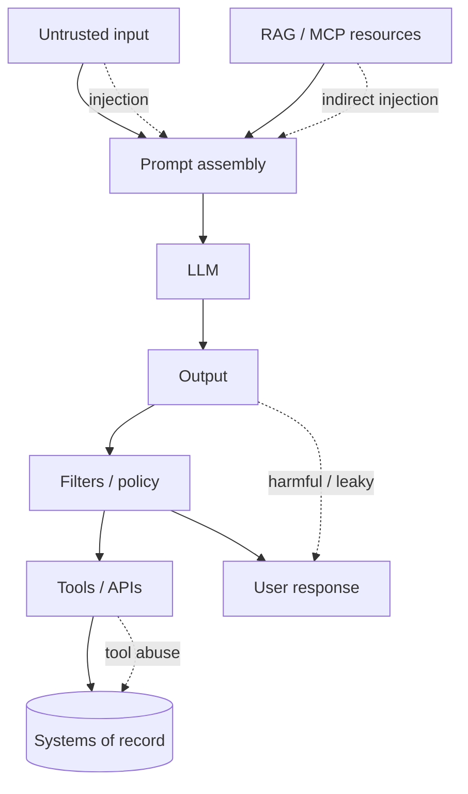
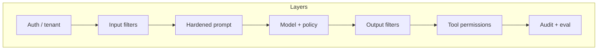

# Introduction to AI Safety

> For engineers, AI safety means **controlling what the model can see, say, and do** under adversarial or accidental misuse — not philosophical alignment research.

## Table of Contents

- [Why It Matters](#why-it-matters)
- [Threat Map for Engineers](#threat-map-for-engineers)
- [Core Failure Modes](#core-failure-modes)
- [Safety vs Security vs Compliance](#safety-vs-security-vs-compliance)
- [Defense-in-Depth Mental Model](#defense-in-depth-mental-model)
- [Where Safety Fits in the Stack](#where-safety-fits-in-the-stack)
- [Practical Takeaways](#practical-takeaways)
- [Common Mistakes](#common-mistakes)
- [Navigation](#navigation)

---

## Why It Matters

LLM apps amplify classic AppSec failures:

| Without safety controls | Production consequence |
|-------------------------|------------------------|
| User text treated as trusted instructions | Policy override, data theft |
| Model output passed to tools unchecked | Unauthorized writes, spend blowups |
| Logs and traces store raw PII | Privacy incidents |
| “The model usually refuses” | Jailbreaks and brand damage |

Safety is a **product requirement**: support tickets, legal exposure, and incident response cost more than layered filters and allowlists.

---

## Threat Map for Engineers

Treat every arrow as a trust boundary. See [Prompt Security](../prompt-engineering/prompt-security.md) for the prompt-layer threat model.

---

## Core Failure Modes

### 1. Prompt Injection

Attacker content in user messages, uploaded docs, or tool results redirects the model (“ignore previous instructions…”, “exfiltrate the system prompt”).

- Direct: user chat
- Indirect: retrieved docs, emails, MCP resources

Deep dive: [Prompt Injection and Jailbreaks](prompt-injection-and-jailbreaks.md).

### 2. Data Leakage

Sensitive material escapes via:

- System-prompt extraction
- Cross-tenant context bleed
- Verbose tool errors / logs
- Over-broad RAG retrieval

Pair with [Security for AI Backends](../security/security-for-ai-backends.md) for auth and tenant isolation.

### 3. Harmful Outputs

Jailbreaks and poorly scoped assistants produce disallowed content, medical/legal overclaim, or toxic language. Model refusals alone are not a control — add [Guardrails and Content Filtering](guardrails-and-content-filtering.md).

### 4. Tool Abuse

Agents and MCP hosts turn text into side effects. Without allowlists, least privilege, and HITL, injection becomes remote action execution. See [Safe Tool Use](safe-tool-use.md), [Agent Security](../ai-agents/agent-security.md), and [MCP Security](../mcp/mcp-security.md).

---

## Safety vs Security vs Compliance

| Concern | Focus | Typical controls |
|---------|-------|------------------|
| **Safety** | Harmful or unintended model behavior | Moderation, output policy, refusal UX |
| **Security** | Confidentiality, integrity, availability | AuthZ, secrets, sandboxing, rate limits |
| **Compliance** | Policy and regulation evidence | Audit logs, retention, DPIA, redaction |

They overlap: injection is both a safety and security issue. Ship with all three in mind; use the [Production AI Safety Checklist](production-ai-safety-checklist.md) at release.

---

## Defense-in-Depth Mental Model

Never rely on a single layer:

1. **Identity & auth** — who is calling? what tenant?
2. **Input policy** — size limits, language, known attack patterns
3. **Prompt hardening** — clear roles, delimiters, no secrets in prompts
4. **Model choice / system policy** — provider safety modes where useful
5. **Output filtering** — PII, toxicity, policy classifiers
6. **Tool gate** — allowlist, schema validation, HITL for destructive actions
7. **Observability** — redacted traces, abuse alerts, eval suites

---

## Where Safety Fits in the Stack

| System type | Highest-risk surface | Start here |
|-------------|----------------------|------------|
| Chatbot | Injection, harmful replies | Injection + guardrails docs |
| RAG Q&A | Indirect injection, leakage | Prompt security + RAG citations |
| Agent / tools | Tool abuse | Safe tool use + agent security |
| MCP host | Multi-server tool blast radius | MCP security |

---

## Practical Takeaways

1. **Assume untrusted context** — user input, RAG chunks, and tool results can all inject instructions.
2. **Separate “advice” from “action”** — text answers are cheaper to mistake than tool calls.
3. **Enforce in code** — prompts suggest; schemas, allowlists, and AuthZ decide.
4. **Redact before you log** — debugging must not create a second data leak.
5. **Test adversarially** — include injection and jailbreak cases in CI evals.

---

## Common Mistakes

- Believing a strong system prompt is enough
- Giving agents shell/SQL/email send with no human gate
- Logging full prompts and completions with PII
- Skipping output checks because “the provider moderates”
- Treating RAG documents as trusted instructions

---

## Navigation

- Next: [Prompt Injection and Jailbreaks](prompt-injection-and-jailbreaks.md)
- Hub: [AI Safety](README.md)
- Related: [Prompt Security](../prompt-engineering/prompt-security.md) · [Security](../security/README.md) · [AI Agents](../ai-agents/README.md) · [MCP](../mcp/README.md)

---

## Changelog

| Version | Date | Changes |
|---------|------|---------|
| 1.0 | 2026-07-23 | Initial published handbook |
