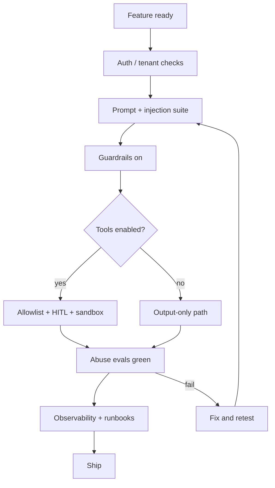

# Production AI Safety Checklist

> Use this checklist before exposing an LLM feature to real users or enabling write tools. Every unchecked box is an accepted risk — document who owns it.

## Table of Contents

- [How to Use](#how-to-use)
- [Release Gate Flow](#release-gate-flow)
- [Identity and Tenancy](#identity-and-tenancy)
- [Prompts and Injection](#prompts-and-injection)
- [Guardrails and Filtering](#guardrails-and-filtering)
- [Tools and Agents](#tools-and-agents)
- [Data and PII](#data-and-pii)
- [Evaluation and Abuse Testing](#evaluation-and-abuse-testing)
- [Observability and Incident Response](#observability-and-incident-response)
- [Go / No-Go](#go--no-go)
- [Practical Takeaways](#practical-takeaways)
- [Navigation](#navigation)

---

## How to Use

1. Copy into the PR or launch doc.
2. Mark each item `done` / `n/a` / `risk accepted`.
3. Require security or tech-lead sign-off for anything `risk accepted` involving tools or PII.
4. Re-run after major prompt, model, tool, or MCP server changes.

Companion deep dives: [Introduction](introduction-to-ai-safety.md) · [Injection](prompt-injection-and-jailbreaks.md) · [Guardrails](guardrails-and-content-filtering.md) · [Safe Tool Use](safe-tool-use.md) · [Production AI Security](../ai-deployment/security-production-ai.md).

---

## Release Gate Flow

---

## Identity and Tenancy

- [ ] All AI endpoints require authentication
- [ ] Authorization checked per resource (not only “logged in”)
- [ ] Tenant isolation for prompts, memory, vector indexes, and tool credentials
- [ ] Rate limits per user / tenant / API key
- [ ] No shared admin credentials in agent or MCP runtime

See [Security for AI Backends](../security/security-for-ai-backends.md).

---

## Prompts and Injection

- [ ] System / developer prompts loaded from controlled config, not user input
- [ ] Untrusted content delimited and labeled as data
- [ ] RAG / MCP / tool results treated as untrusted
- [ ] No secrets or raw credentials in prompts
- [ ] Injection and jailbreak cases in automated evals
- [ ] Prompt changes go through review (same as code)

See [Prompt Security](../prompt-engineering/prompt-security.md).

---

## Guardrails and Filtering

- [ ] Pre-check: size limits, auth, basic policy
- [ ] Post-check: content policy and/or domain rules
- [ ] Streaming path does not leak unfiltered sensitive spans
- [ ] Safe refusal UX (no attack echo, no internal policy dump)
- [ ] Metrics for block rates and false-positive review path

---

## Tools and Agents

- [ ] Tool registry allowlist; deny unknown names
- [ ] JSON Schema / Pydantic validation on all args
- [ ] Risk classes mapped to auto vs HITL
- [ ] Destructive actions require human approval UI (not prompt-only)
- [ ] Resource-level AuthZ re-checked at execution time
- [ ] Timeouts, retries, and idempotency keys for writes
- [ ] Sandbox / egress limits for code or shell tools
- [ ] MCP: only approved servers; new tools not auto-trusted

See [Safe Tool Use](safe-tool-use.md) · [Agent Security](../ai-agents/agent-security.md) · [MCP Security](../mcp/mcp-security.md).

---

## Data and PII

- [ ] Minimize PII sent to the model
- [ ] Redaction before logs, traces, and analytics exports
- [ ] Retention limits on prompt/completion storage
- [ ] Vendor DPAs / data residency reviewed for model providers
- [ ] Support and debug tooling cannot browse other tenants’ transcripts casually

---

## Evaluation and Abuse Testing

- [ ] Golden offline suite includes safety cases (injection, jailbreak, PII, tool misuse)
- [ ] Online monitors for refusal rate, filter blocks, anomalous tool calls
- [ ] Red-team or adversarial pass before GA for high-risk features
- [ ] Model/provider upgrade triggers re-run of safety suite

---

## Observability and Incident Response

- [ ] Correlation IDs across gateway → model → tools
- [ ] Audit log for tool decisions (allow / deny / HITL)
- [ ] Alerts on tool-call spikes and filter-block spikes
- [ ] Kill switch: disable tools or feature flag the assistant
- [ ] Runbook: injection incident, data leak, abusive generation
- [ ] On-call knows how to rotate keys and revoke sessions

---

## Go / No-Go

| Signal | Go | No-go |
|--------|----|-------|
| AuthZ + tenancy | Proven with tests | Shared indexes or keys |
| Tools | Allowlisted + HITL for writes | Free-form shell/SQL |
| Evals | Safety suite passing | “We’ll add tests later” |
| Logging | Redaction verified | Raw PII in SaaS traces |
| Kill switch | Feature flag ready | Only deploy rollback |

**Ship only when No-go column is empty or explicitly accepted in writing.**

---

## Practical Takeaways

1. **Checklist is a gate**, not documentation theater — block launches.
2. **Tools dominate risk** — treat write paths like payment code.
3. **Re-run on change** — prompts and models drift like dependencies.
4. **Assume incident day one** — kill switch and runbooks before marketing.
5. **Cross-link security domains** — safety does not replace AppSec.

---

## Navigation

- Prev: [Safe Tool Use](safe-tool-use.md)
- Hub: [AI Safety](README.md)
- Related: [Prompt Security](../prompt-engineering/prompt-security.md) · [Security](../security/README.md) · [AI Agents](../ai-agents/README.md) · [MCP](../mcp/README.md) · [Production AI Security](../ai-deployment/security-production-ai.md)

---

## Changelog

| Version | Date | Changes |
|---------|------|---------|
| 1.0 | 2026-07-23 | Initial published handbook |
