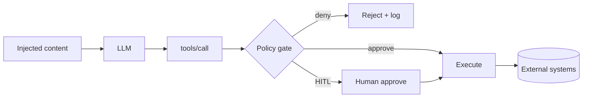
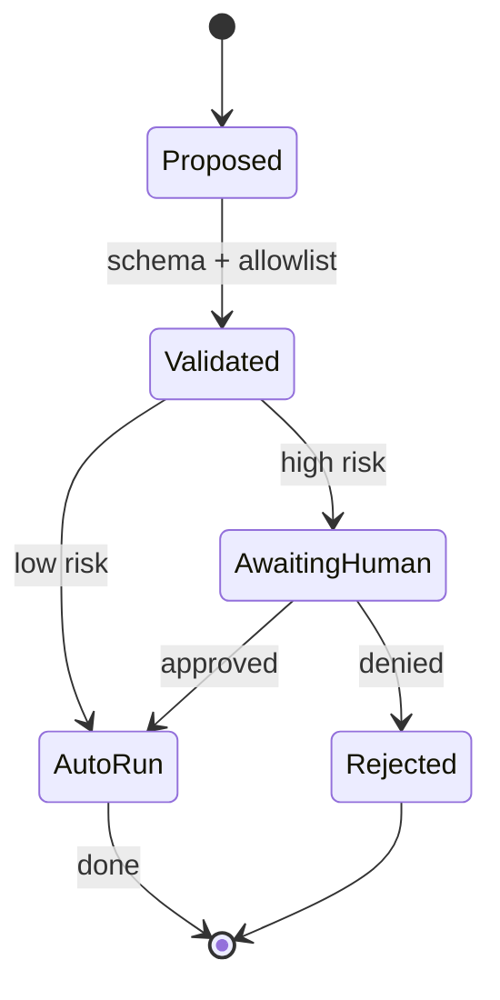

# Safe Tool Use

> Tools turn model text into **side effects**. Safety for tools is authorization engineering: allowlists, least privilege, and human gates — not hoping the model is careful.

## Table of Contents

- [Why Tools Change the Threat Model](#why-tools-change-the-threat-model)
- [Allowlists and Registries](#allowlists-and-registries)
- [Least Privilege](#least-privilege)
- [Human-in-the-Loop](#human-in-the-loop)
- [Argument Validation](#argument-validation)
- [Sandboxing and Isolation](#sandboxing-and-isolation)
- [MCP-Specific Notes](#mcp-specific-notes)
- [Practical Takeaways](#practical-takeaways)
- [Common Mistakes](#common-mistakes)
- [Navigation](#navigation)

---

## Why Tools Change the Threat Model



Without a gate, prompt injection becomes **confused deputy** execution. Pair this doc with [Agent Security](../ai-agents/agent-security.md) and [Tool Use](../ai-agents/tool-use.md).

---

## Allowlists and Registries

Expose tools only through a **versioned registry**:

| Field | Why |
|-------|-----|
| `name` | Stable ID; no free-form invention |
| `description` | Model-facing; keep precise |
| `parameters` | JSON Schema |
| `risk_class` | `read` / `write` / `destructive` / `admin` |
| `permissions` | Required roles / scopes |
| `timeout_s` | Hard cap |
| `idempotent` | Retry policy |

Rules:

1. Model may only call names present in the registry for that session/tenant.
2. Dynamic discovery (e.g. MCP) must still map into the same policy engine.
3. Disable tools by config without redeploying prompts.

```python
ALLOWED = {"search_docs", "get_ticket", "create_draft"}

def authorize_tool(name: str, principal: Principal) -> None:
    if name not in ALLOWED:
        raise PermissionError(f"tool not allowlisted: {name}")
    if not principal.can(name):
        raise PermissionError("insufficient role")
```

---

## Least Privilege

| Principle | Practice |
|-----------|----------|
| Minimal tool set | Per-product / per-role tool packs |
| Minimal credentials | Scoped API keys; no shared root tokens |
| Minimal data | Return summaries, not full DB rows |
| Minimal network | Egress allowlists for sandboxes |
| Minimal lifetime | Short-lived tokens per run |

Split **read** servers from **write** servers when using MCP ([MCP Security](../mcp/mcp-security.md)).

Never give a general assistant:

- Unrestricted shell
- Raw SQL against production
- Broad file-system write
- Unscoped email send

---

## Human-in-the-Loop

Require HITL when impact is high or confidence is low. See [Human-in-the-Loop](../ai-agents/human-in-the-loop.md).

| Risk class | Default gate |
|------------|--------------|
| Read / search | Auto if AuthZ ok |
| Create draft | Auto or soft confirm |
| Send / publish / pay | Human approve |
| Delete / revoke / admin | Human + dual control for critical |



Show humans: tool name, args (redacted), principal, risk reason, and blast radius.

---

## Argument Validation

Never trust model-produced JSON:

1. Parse against JSON Schema / Pydantic
2. Enforce enums, ranges, max string lengths
3. Resolve IDs against tenant-scoped lookups (no cross-tenant IDs)
4. Canonicalize paths/URLs; block SSRF targets ([Security for AI Backends](../security/security-for-ai-backends.md))
5. Re-check AuthZ on the **resource**, not just the tool name

Example policy: `delete_ticket` may only delete tickets where `ticket.owner == principal` or role `support_admin`.

---

## Sandboxing and Isolation

For code execution and untrusted tools:

- Containers / microVMs with read-only root FS
- No cloud metadata endpoints
- CPU, memory, time, and output-size limits
- Separate network namespaces

Log `principal`, `tool`, `args_hash`, `decision`, `latency`, `outcome` for audit — align with [MCP Security](../mcp/mcp-security.md) audit guidance.

---

## MCP-Specific Notes

MCP expands discovery: hosts may see many servers.

1. Pin approved servers and tool hashes where possible
2. Do not auto-enable new tools from unknown servers
3. Treat resource contents as untrusted (indirect injection) — [Prompt Injection and Jailbreaks](prompt-injection-and-jailbreaks.md)
4. Separate credentials per server and tenant

---

## Practical Takeaways

1. **Allowlist every tool** — deny by default.
2. **Classify risk** — map classes to auto vs HITL.
3. **Authorize twice** — tool permission and resource ACL.
4. **Validate args in code** — schemas before side effects.
5. **Sandbox high-risk execution** — assume injection will try them.

---

## Common Mistakes

- One mega-tool (`run_command`) for convenience
- HITL only in the prompt (“ask the user first”) with no UI gate
- Logging full tool args including secrets
- Sharing admin MCP servers across tenants
- Retrying non-idempotent write tools on timeout without dedupe keys

---

## Navigation

- Prev: [Guardrails and Content Filtering](guardrails-and-content-filtering.md)
- Next: [Production AI Safety Checklist](production-ai-safety-checklist.md)
- Related: [Tool Use](../ai-agents/tool-use.md) · [Agent Security](../ai-agents/agent-security.md) · [MCP Security](../mcp/mcp-security.md)

---

## Changelog

| Version | Date | Changes |
|---------|------|---------|
| 1.0 | 2026-07-23 | Initial published handbook |
