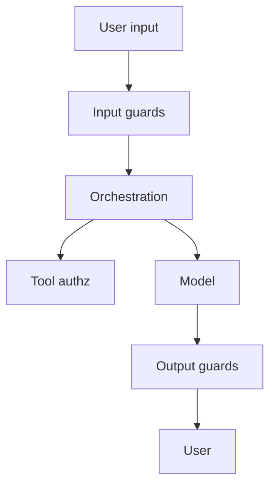

# AI Security & Guardrails

> Threat models, prompt injection, data leakage, and layered guardrails for LLM applications.

**Prerequisites:** [LLM Application Development](../llm-application-development/README.md)  
**Unlocks:** [AI Deployment & Infrastructure](../ai-deployment/README.md) · [AI Agents](../ai-agents/README.md)

---

## Definition

**AI security & guardrails** cover protecting AI systems and users: prompt injection, jailbreaks, sensitive-data exfiltration, unsafe tool use, supply-chain risks, and policy enforcement. Guardrails are layered controls (input/output filters, allowlisted tools, human approval) — not a single magic classifier.

---

## Learning path

---

## Documents

| # | Topic | Document |
|---|-------|----------|
| 1 | Threat model for LLM apps | [llm-threat-model.md](llm-threat-model.md) |
| 2 | Guardrail layers | [guardrail-layers.md](guardrail-layers.md) |
| 3 | Secure tool use | [secure-tool-use.md](secure-tool-use.md) |

---

## Related topics

- [AI Safety handbook](../ai-safety/README.md)
- [Security domain](../security/README.md)
- [Prompt security](../prompt-engineering/README.md)

---

## See also

- [Domains overview](../README.md)
- [Learning Roadmap](../../meta/roadmap.md)
- [Master Index](../../meta/indexes/MASTER-INDEX.md)
